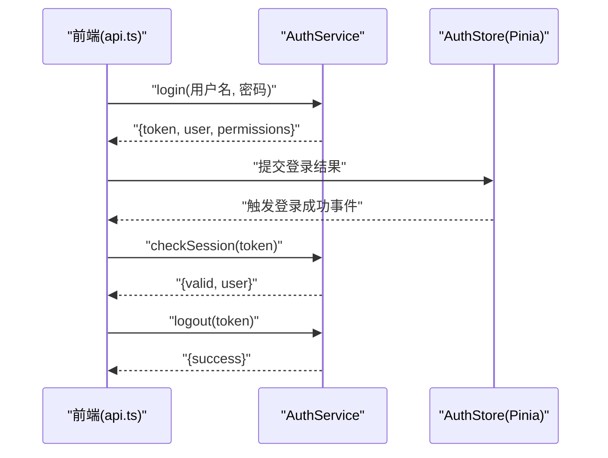
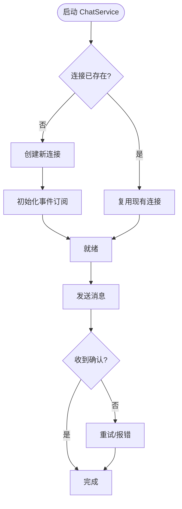
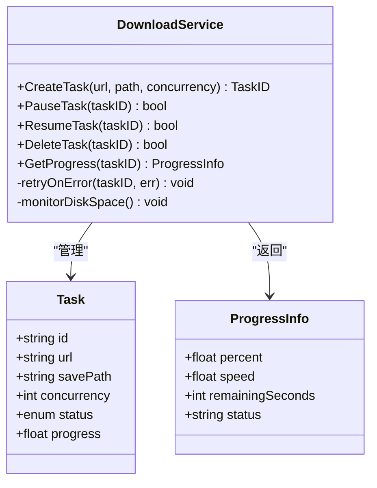
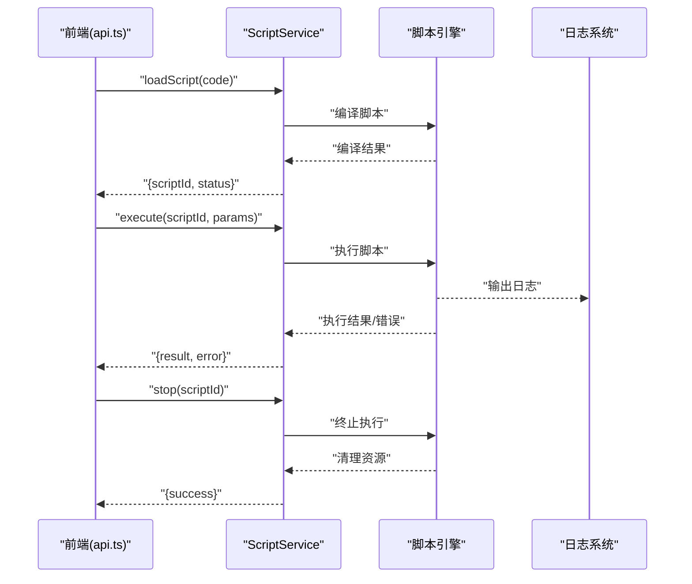
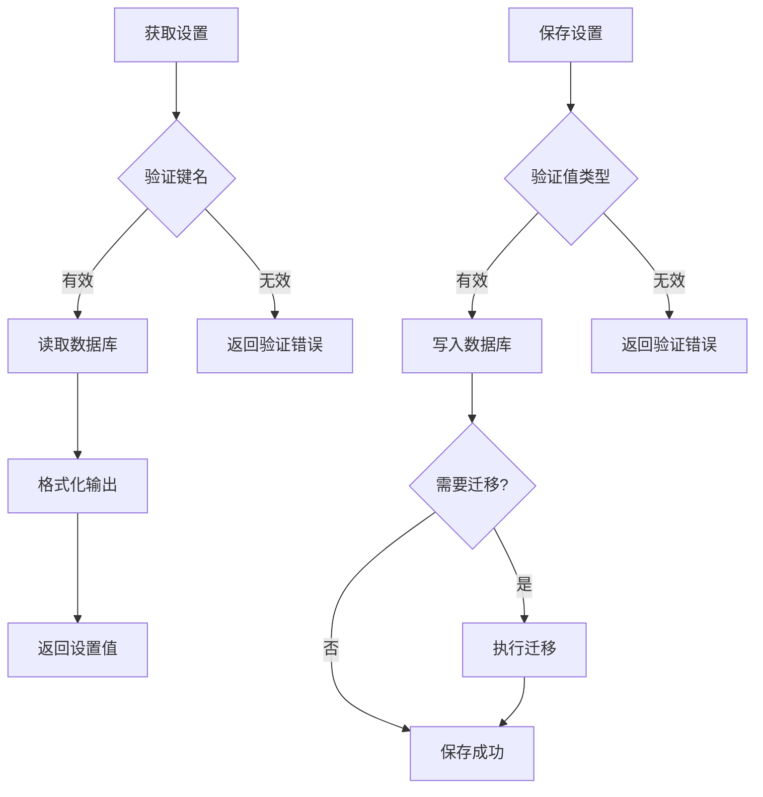
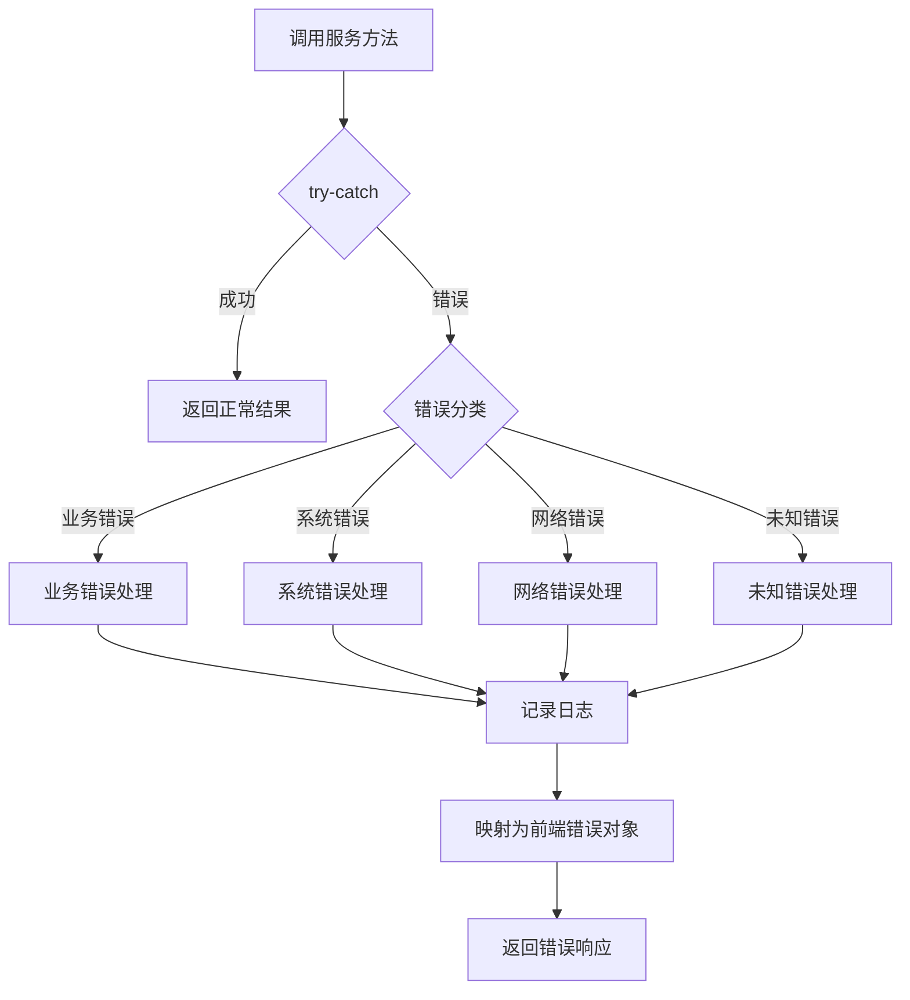
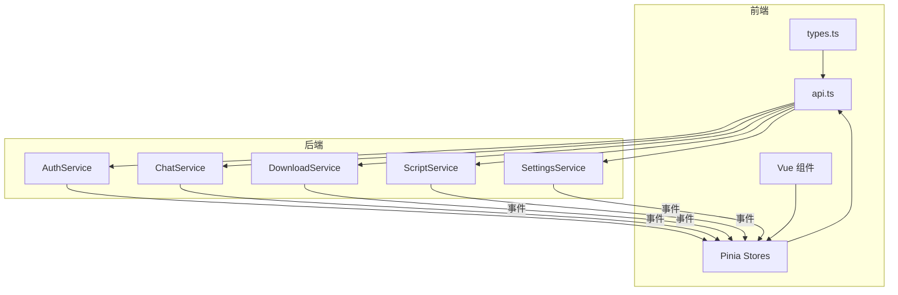

# Wails 服务层 API 契约

<cite>
**本文引用的文件**   
- [auth.go](file://src/internal/services/auth.go)
- [chat.go](file://src/internal/services/chat.go)
- [download.go](file://src/internal/services/download.go)
- [script.go](file://src/internal/services/script.go)
- [settings.go](file://src/internal/services/settings.go)
- [api.ts](file://src/frontend/src/api.ts)
- [types.ts](file://src/frontend/src/types.ts)
</cite>

## 目录
- 概述
- AuthService
- ChatService
- DownloadService
- ScriptService
- SettingsService
- 错误处理统一模式
- 前端 api.ts 映射表

## 概述
本文件聚焦于 src/internal/services/ 下的五大服务：AuthService、ChatService、DownloadService、ScriptService、SettingsService。文档围绕以下维度展开：
- 方法签名与职责边界
- 请求/响应类型（Go 结构体字段与 JSON tag）
- 错误处理模式（返回码、错误信息、事件上报）
- 与前端 src/frontend/src/api.ts 的调用映射关系
- 关键数据流与状态流转（含懒启动、断线重建、通道串行化等）

说明：
- 后端通过 Wails 暴露 Go 方法，前端通过 window.go.services.* 统一调用。
- 所有前后端契约以 types.ts 中的类型定义为准；修改 Go 结构体 JSON tag 后需同步更新前端类型。
- 事件订阅在 Pinia store 的 init() 中完成，App.vue onMounted 统一初始化各 store。

## AuthService
职责
- 用户登录、登出、会话校验、权限判断
- 与后端认证状态联动，维护登录态

方法与类型要点
- 登录接口
  - 输入：用户名、密码（具体字段名以 Go 结构体 JSON tag 为准）
  - 输出：会话标识、用户基本信息、权限列表
  - 错误：账号不存在、密码错误、网络异常、服务端内部错误
- 登出接口
  - 输入：无或会话标识
  - 输出：成功标志
  - 错误：会话无效、服务端错误
- 会话校验
  - 输入：会话标识
  - 输出：是否有效、当前用户信息
  - 错误：会话过期、服务端错误

错误处理模式
- 业务错误：返回明确的错误码与消息，便于前端提示
- 系统错误：记录日志并返回通用错误码
- 事件通知：登录/登出成功后推送事件，供前端 store 刷新状态

与前端映射
- 前端 api.ts 提供 login/logout/checkSession 等方法，封装 window.go.services.auth.* 调用
- 错误统一捕获并转换为前端可展示的错误对象

图表来源
- [auth.go](file://src/internal/services/auth.go)
- [api.ts](file://src/frontend/src/api.ts)
- [types.ts](file://src/frontend/src/types.ts)

章节来源
- [auth.go](file://src/internal/services/auth.go)
- [api.ts](file://src/frontend/src/api.ts)
- [types.ts](file://src/frontend/src/types.ts)

## ChatService
职责
- 建立与管理聊天连接（WebSocket/长连接）
- 消息收发、事件订阅、断线重连、任务队列串行化

方法与类型要点
- 连接管理
  - 启动连接：懒启动，首次使用时建立连接
  - 关闭连接：显式关闭或应用退出时清理
  - 重连策略：指数退避 + 最大重试次数
- 消息发送
  - 输入：消息体（包含类型、内容、目标等）
  - 输出：发送确认、回执消息
  - 错误：连接断开、消息过大、序列化失败
- 事件订阅
  - 支持多种事件类型（如新消息、状态变更、错误通知）
  - 通过通道将事件分发到前端 store

错误处理模式
- 连接错误：记录日志、触发重连、向前端上报错误事件
- 消息错误：丢弃或重试（根据消息类型），并通知前端
- 资源清理：确保连接关闭、通道释放

与前端映射
- 前端通过 api.ts 的 chat.* 方法发起连接、发送消息、订阅事件
- 事件通过 Pinia store 的 init() 订阅，组件消费事件更新 UI

图表来源
- [chat.go](file://src/internal/services/chat.go)
- [api.ts](file://src/frontend/src/api.ts)
- [types.ts](file://src/frontend/src/types.ts)

章节来源
- [chat.go](file://src/internal/services/chat.go)
- [api.ts](file://src/frontend/src/api.ts)
- [types.ts](file://src/frontend/src/types.ts)

## DownloadService
职责
- 下载任务管理（创建、暂停、恢复、删除）
- 进度跟踪、错误重试、存储路径管理

方法与类型要点
- 任务操作
  - 创建任务：输入 URL、保存路径、并发数等
  - 暂停/恢复：按任务 ID 控制状态
  - 删除任务：移除任务及临时文件
- 进度查询
  - 输入：任务 ID
  - 输出：进度百分比、速度、剩余时间、状态
- 错误处理
  - 网络错误：自动重试（可配置）
  - 磁盘错误：提示用户并停止任务
  - 权限错误：检查写入权限并反馈

错误处理模式
- 任务级错误：记录错误原因，更新任务状态为失败
- 全局错误：监控磁盘空间、权限等环境因素
- 事件上报：进度、错误、完成事件推送至前端

与前端映射
- 前端 api.ts 提供 download.* 方法，封装任务生命周期管理
- 进度事件通过 store 订阅，实时更新 UI

图表来源
- [download.go](file://src/internal/services/download.go)
- [api.ts](file://src/frontend/src/api.ts)
- [types.ts](file://src/frontend/src/types.ts)

章节来源
- [download.go](file://src/internal/services/download.go)
- [api.ts](file://src/frontend/src/api.ts)
- [types.ts](file://src/frontend/src/types.ts)

## ScriptService
职责
- 脚本引擎管理（加载、执行、调试）
- 脚本生命周期控制、错误捕获、日志输出

方法与类型要点
- 脚本管理
  - 加载脚本：从文件或内存加载
  - 执行脚本：异步执行，支持参数传递
  - 停止脚本：强制终止或优雅退出
- 调试与日志
  - 输出调试信息到日志系统
  - 捕获运行时错误并上报
- 错误处理
  - 语法错误：解析阶段报错
  - 运行时错误：执行阶段报错，记录堆栈
  - 资源错误：内存不足、超时等

错误处理模式
- 脚本错误：分类记录（语法、运行时、资源），提供详细上下文
- 性能监控：记录执行耗时、内存占用
- 安全限制：沙箱执行，限制敏感操作

与前端映射
- 前端 api.ts 提供 script.* 方法，封装脚本生命周期管理
- 日志和错误通过事件推送至前端，用于调试面板显示

图表来源
- [script.go](file://src/internal/services/script.go)
- [api.ts](file://src/frontend/src/api.ts)
- [types.ts](file://src/frontend/src/types.ts)

章节来源
- [script.go](file://src/internal/services/script.go)
- [api.ts](file://src/frontend/src/api.ts)
- [types.ts](file://src/frontend/src/types.ts)

## SettingsService
职责
- 应用设置管理（读取、保存、默认值）
- 设置验证、迁移、备份恢复

方法与类型要点
- 设置操作
  - 获取设置：按键获取或批量获取
  - 保存设置：单个键或批量保存
  - 重置设置：恢复到默认值
- 验证与迁移
  - 类型验证：确保数据类型正确
  - 版本迁移：旧格式升级到新格式
- 错误处理
  - 验证错误：返回具体字段错误
  - 持久化错误：文件系统问题，重试或回滚

错误处理模式
- 验证错误：结构化错误，包含字段名和错误信息
- 持久化错误：记录详细日志，提供重试机制
- 兼容性处理：向后兼容旧版本设置格式

与前端映射
- 前端 api.ts 提供 settings.* 方法，封装设置 CRUD 操作
- 设置变更通过事件通知前端，实现实时生效

图表来源
- [settings.go](file://src/internal/services/settings.go)
- [api.ts](file://src/frontend/src/api.ts)
- [types.ts](file://src/frontend/src/types.ts)

章节来源
- [settings.go](file://src/internal/services/settings.go)
- [api.ts](file://src/frontend/src/api.ts)
- [types.ts](file://src/frontend/src/types.ts)

## 错误处理统一模式
设计原则
- 分层错误：业务错误、系统错误、网络错误分类处理
- 标准化错误对象：统一的错误结构，包含代码、消息、详情
- 日志记录：所有错误都记录到日志系统，便于排查
- 用户友好：向用户展示简洁明了的错误信息

错误分类
- 业务错误：如账号不存在、权限不足、参数无效
- 系统错误：如数据库连接失败、文件读写错误
- 网络错误：如超时、连接中断、DNS 解析失败
- 未知错误：兜底处理，记录详细上下文

错误传播
- 后端：错误向上层返回，同时记录日志
- 前端：统一捕获错误，转换为用户友好的提示
- 事件驱动：重要错误通过事件通知相关模块

图表来源
- [auth.go](file://src/internal/services/auth.go)
- [chat.go](file://src/internal/services/chat.go)
- [download.go](file://src/internal/services/download.go)
- [script.go](file://src/internal/services/script.go)
- [settings.go](file://src/internal/services/settings.go)
- [api.ts](file://src/frontend/src/api.ts)

章节来源
- [auth.go](file://src/internal/services/auth.go)
- [chat.go](file://src/internal/services/chat.go)
- [download.go](file://src/internal/services/download.go)
- [script.go](file://src/internal/services/script.go)
- [settings.go](file://src/internal/services/settings.go)
- [api.ts](file://src/frontend/src/api.ts)

## 前端 api.ts 映射表
调用约定
- 所有后端服务通过 window.go.services.* 暴露
- 方法命名遵循驼峰命名法，与 Go 方法名对应
- 错误统一捕获，转换为标准错误对象

映射关系
- AuthService
  - login → window.go.services.auth.login
  - logout → window.go.services.auth.logout
  - checkSession → window.go.services.auth.checkSession
- ChatService
  - connect → window.go.services.chat.connect
  - sendMessage → window.go.services.chat.sendMessage
  - subscribe → window.go.services.chat.subscribe
- DownloadService
  - createTask → window.go.services.download.createTask
  - pauseTask → window.go.services.download.pauseTask
  - resumeTask → window.go.services.download.resumeTask
  - deleteTask → window.go.services.download.deleteTask
  - getProgress → window.go.services.download.getProgress
- ScriptService
  - loadScript → window.go.services.script.loadScript
  - execute → window.go.services.script.execute
  - stop → window.go.services.script.stop
- SettingsService
  - getSetting → window.go.services.settings.getSetting
  - setSetting → window.go.services.settings.setSetting
  - resetSettings → window.go.services.settings.resetSettings

类型契约
- 所有请求/响应类型定义在 types.ts
- Go 结构体的 JSON tag 必须与前端类型保持一致
- 枚举值使用字符串表示，保持前后端一致

事件订阅
- 各 store 在 init() 中订阅相应事件
- App.vue onMounted 统一调用各 store.init()
- 事件格式统一，包含类型、数据、时间戳

图表来源
- [api.ts](file://src/frontend/src/api.ts)
- [types.ts](file://src/frontend/src/types.ts)
- [auth.go](file://src/internal/services/auth.go)
- [chat.go](file://src/internal/services/chat.go)
- [download.go](file://src/internal/services/download.go)
- [script.go](file://src/internal/services/script.go)
- [settings.go](file://src/internal/services/settings.go)

章节来源
- [api.ts](file://src/frontend/src/api.ts)
- [types.ts](file://src/frontend/src/types.ts)
- [auth.go](file://src/internal/services/auth.go)
- [chat.go](file://src/internal/services/chat.go)
- [download.go](file://src/internal/services/download.go)
- [script.go](file://src/internal/services/script.go)
- [settings.go](file://src/internal/services/settings.go)