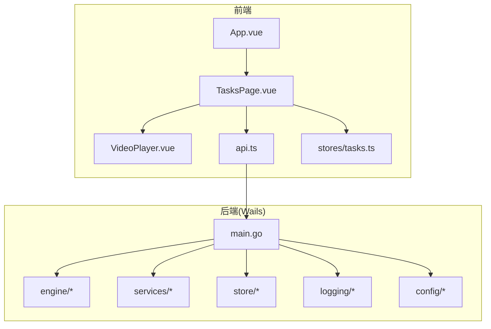
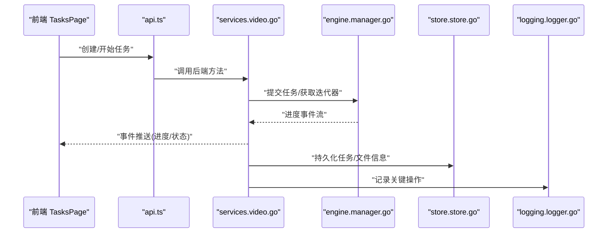
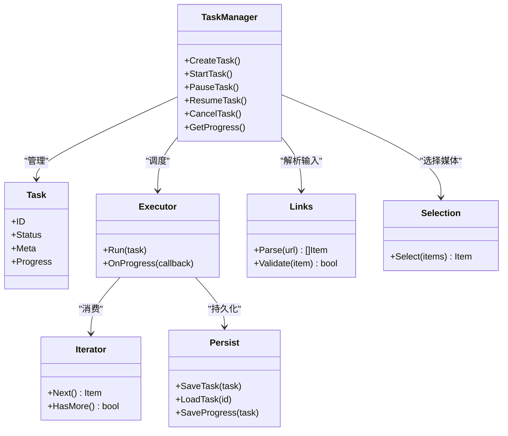
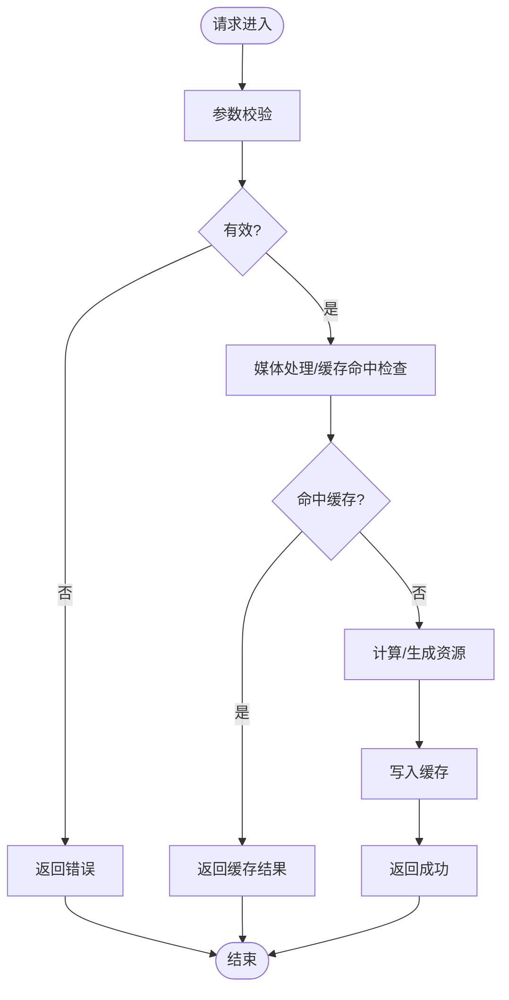
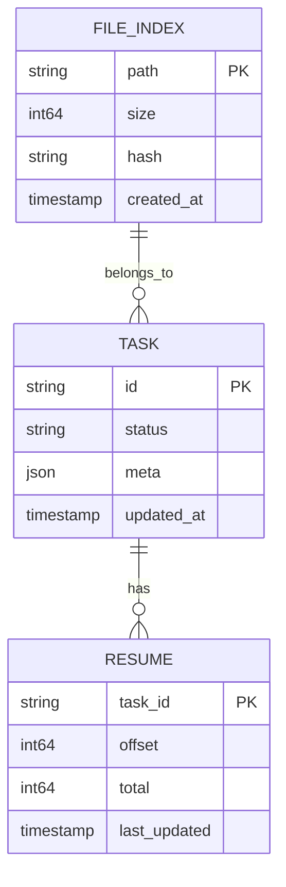
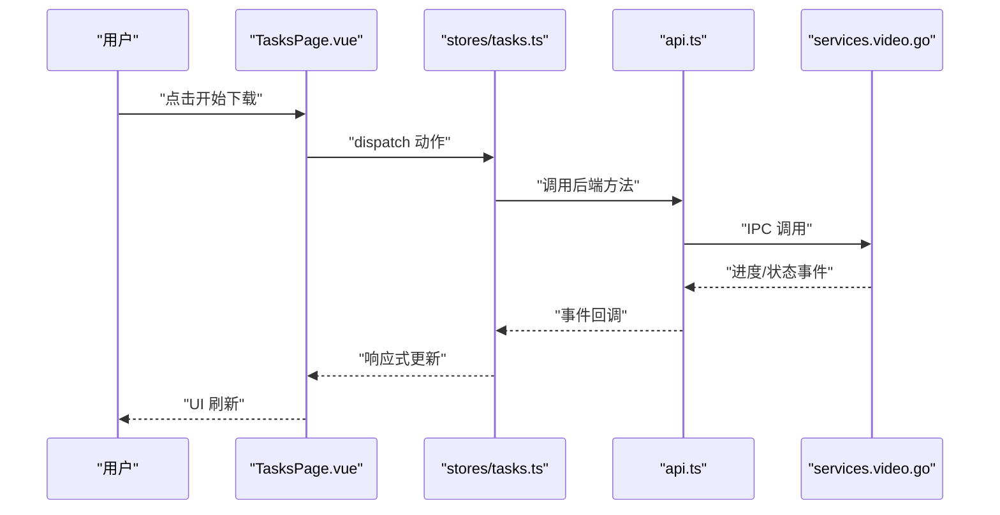
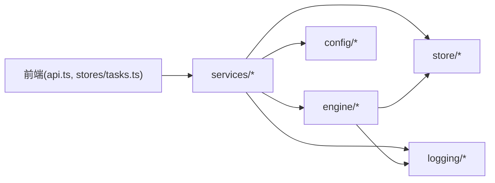

# 视频缓存系统

<cite>
**本文引用的文件**   
- [src/main.go](file://src/main.go)
- [src/wails.json](file://src/wails.json)
- [src/go.mod](file://src/go.mod)
- [src/internal/engine/manager.go](file://src/internal/engine/manager.go)
- [src/internal/engine/task.go](file://src/internal/engine/task.go)
- [src/internal/engine/executor.go](file://src/internal/engine/executor.go)
- [src/internal/engine/iter.go](file://src/internal/engine/iter.go)
- [src/internal/engine/progress.go](file://src/internal/engine/progress.go)
- [src/internal/engine/persist.go](file://src/internal/engine/persist.go)
- [src/internal/engine/links.go](file://src/internal/engine/links.go)
- [src/internal/engine/selection.go](file://src/internal/engine/selection.go)
- [src/internal/services/video.go](file://src/internal/services/video.go)
- [src/internal/services/media_handler.go](file://src/internal/services/media_handler.go)
- [src/internal/services/thumbcache.go](file://src/internal/services/thumbcache.go)
- [src/internal/store/store.go](file://src/internal/store/store.go)
- [src/internal/store/file_repo.go](file://src/internal/store/file_repo.go)
- [src/internal/store/task_repo.go](file://src/internal/store/task_repo.go)
- [src/internal/store/resume_repo.go](file://src/internal/store/resume_repo.go)
- [src/internal/logging/logger.go](file://src/internal/logging/logger.go)
- [src/internal/config/config.go](file://src/internal/config/config.go)
- [src/frontend/src/api.ts](file://src/frontend/src/api.ts)
- [src/frontend/src/types.ts](file://src/frontend/src/types.ts)
- [src/frontend/src/App.vue](file://src/frontend/src/App.vue)
- [src/frontend/src/pages/TasksPage.vue](file://src/frontend/src/pages/TasksPage.vue)
- [src/frontend/src/components/VideoPlayer.vue](file://src/frontend/src/components/VideoPlayer.vue)
- [src/frontend/src/stores/tasks.ts](file://src/frontend/src/stores/tasks.ts)
</cite>

## 目录
1. [简介](#简介)
2. [项目结构](#项目结构)
3. [核心组件](#核心组件)
4. [架构总览](#架构总览)
5. [详细组件分析](#详细组件分析)
6. [依赖关系分析](#依赖关系分析)
7. [性能考量](#性能考量)
8. [故障排查指南](#故障排查指南)
9. [结论](#结论)
10. [附录](#附录)

## 简介
本仓库是一个基于 Wails（Go + Vue）的跨平台桌面应用，聚焦“视频缓存与播放”能力。后端通过 Go 实现下载引擎、任务管理、媒体处理与缩略图缓存；前端使用 Vue 3 + PrimeVue 提供任务列表、视频预览与播放器界面。整体采用前后端分离、IPC 通信模式，结合持久化存储与进度事件驱动，形成可恢复、可扩展的视频缓存系统。

## 项目结构
- 前端：src/frontend 包含 Vue 3 工程，页面、组件、状态管理与 API 封装均位于此。
- 后端：src 为 Go 工程，入口 main.go 启动 Wails 应用，内部模块包括 engine（下载与任务）、services（业务服务）、store（数据持久化）、logging（日志）、config（配置）。
- 子模块：ref/tdl 为 Git 子模块，提供底层 Telegram 客户端能力，禁止直接修改，仅允许同步上游。

图表来源
- [src/main.go](file://src/main.go)
- [src/wails.json](file://src/wails.json)
- [src/frontend/src/App.vue](file://src/frontend/src/App.vue)
- [src/frontend/src/pages/TasksPage.vue](file://src/frontend/src/pages/TasksPage.vue)
- [src/frontend/src/components/VideoPlayer.vue](file://src/frontend/src/components/VideoPlayer.vue)
- [src/frontend/src/api.ts](file://src/frontend/src/api.ts)
- [src/frontend/src/stores/tasks.ts](file://src/frontend/src/stores/tasks.ts)

章节来源
- [src/main.go](file://src/main.go)
- [src/wails.json](file://src/wails.json)
- [src/frontend/src/App.vue](file://src/frontend/src/App.vue)

## 核心组件
- 下载与任务引擎（engine）
  - 任务生命周期管理、迭代器、进度上报、持久化、链接解析与选择策略等。
- 业务服务（services）
  - 视频服务、媒体处理、缩略图缓存等，对外暴露 IPC 接口供前端调用。
- 数据存储（store）
  - 文件索引、任务元数据、断点续传记录等持久化仓储。
- 日志与配置（logging, config）
  - 统一日志输出与运行时配置加载。
- 前端（frontend）
  - 任务页、播放器、API 封装、Pinia Store 与类型契约。

章节来源
- [src/internal/engine/manager.go](file://src/internal/engine/manager.go)
- [src/internal/engine/task.go](file://src/internal/engine/task.go)
- [src/internal/engine/executor.go](file://src/internal/engine/executor.go)
- [src/internal/engine/iter.go](file://src/internal/engine/iter.go)
- [src/internal/engine/progress.go](file://src/internal/engine/progress.go)
- [src/internal/engine/persist.go](file://src/internal/engine/persist.go)
- [src/internal/engine/links.go](file://src/internal/engine/links.go)
- [src/internal/engine/selection.go](file://src/internal/engine/selection.go)
- [src/internal/services/video.go](file://src/internal/services/video.go)
- [src/internal/services/media_handler.go](file://src/internal/services/media_handler.go)
- [src/internal/services/thumbcache.go](file://src/internal/services/thumbcache.go)
- [src/internal/store/store.go](file://src/internal/store/store.go)
- [src/internal/store/file_repo.go](file://src/internal/store/file_repo.go)
- [src/internal/store/task_repo.go](file://src/internal/store/task_repo.go)
- [src/internal/store/resume_repo.go](file://src/internal/store/resume_repo.go)
- [src/internal/logging/logger.go](file://src/internal/logging/logger.go)
- [src/internal/config/config.go](file://src/internal/config/config.go)
- [src/frontend/src/api.ts](file://src/frontend/src/api.ts)
- [src/frontend/src/types.ts](file://src/frontend/src/types.ts)
- [src/frontend/src/stores/tasks.ts](file://src/frontend/src/stores/tasks.ts)

## 架构总览
系统采用“前端 UI + Wails 桥接 + Go 后端服务”的分层架构。前端通过 api.ts 调用 window.go.services.* 暴露的方法，后端 services 层协调 engine 完成下载与媒体处理，并通过 store 层进行持久化。进度与状态通过事件机制回推至前端 Pinia Store，驱动 UI 更新。

图表来源
- [src/frontend/src/pages/TasksPage.vue](file://src/frontend/src/pages/TasksPage.vue)
- [src/frontend/src/api.ts](file://src/frontend/src/api.ts)
- [src/internal/services/video.go](file://src/internal/services/video.go)
- [src/internal/engine/manager.go](file://src/internal/engine/manager.go)
- [src/internal/store/store.go](file://src/internal/store/store.go)
- [src/internal/logging/logger.go](file://src/internal/logging/logger.go)

## 详细组件分析

### 下载与任务引擎（engine）
- 职责
  - 任务编排：创建、调度、执行、暂停、恢复、取消。
  - 迭代器：按批次拉取媒体项，支持分页与过滤。
  - 进度上报：实时回调进度，便于前端展示。
  - 持久化：任务状态、文件映射、断点信息落盘。
  - 链接解析与选择：解析输入链接，选择合适媒体项。
- 关键文件
  - manager.go：任务管理器，负责生命周期与并发控制。
  - task.go：任务模型与状态机。
  - executor.go：执行器，协调下载与写入。
  - iter.go：迭代器，遍历待下载项。
  - progress.go：进度结构与上报通道。
  - persist.go：持久化读写。
  - links.go：链接解析与校验。
  - selection.go：媒体项选择策略。

图表来源
- [src/internal/engine/manager.go](file://src/internal/engine/manager.go)
- [src/internal/engine/task.go](file://src/internal/engine/task.go)
- [src/internal/engine/executor.go](file://src/internal/engine/executor.go)
- [src/internal/engine/iter.go](file://src/internal/engine/iter.go)
- [src/internal/engine/progress.go](file://src/internal/engine/progress.go)
- [src/internal/engine/persist.go](file://src/internal/engine/persist.go)
- [src/internal/engine/links.go](file://src/internal/engine/links.go)
- [src/internal/engine/selection.go](file://src/internal/engine/selection.go)

章节来源
- [src/internal/engine/manager.go](file://src/internal/engine/manager.go)
- [src/internal/engine/task.go](file://src/internal/engine/task.go)
- [src/internal/engine/executor.go](file://src/internal/engine/executor.go)
- [src/internal/engine/iter.go](file://src/internal/engine/iter.go)
- [src/internal/engine/progress.go](file://src/internal/engine/progress.go)
- [src/internal/engine/persist.go](file://src/internal/engine/persist.go)
- [src/internal/engine/links.go](file://src/internal/engine/links.go)
- [src/internal/engine/selection.go](file://src/internal/engine/selection.go)

### 业务服务（services）
- 职责
  - 视频服务：对外暴露视频相关能力（如生成播放地址、触发下载等）。
  - 媒体处理：转码、切片、封面提取等。
  - 缩略图缓存：本地缓存缩略图，加速预览。
- 关键文件
  - video.go：视频服务主逻辑。
  - media_handler.go：媒体处理管道。
  - thumbcache.go：缩略图缓存策略。

图表来源
- [src/internal/services/video.go](file://src/internal/services/video.go)
- [src/internal/services/media_handler.go](file://src/internal/services/media_handler.go)
- [src/internal/services/thumbcache.go](file://src/internal/services/thumbcache.go)

章节来源
- [src/internal/services/video.go](file://src/internal/services/video.go)
- [src/internal/services/media_handler.go](file://src/internal/services/media_handler.go)
- [src/internal/services/thumbcache.go](file://src/internal/services/thumbcache.go)

### 数据存储（store）
- 职责
  - 文件索引：记录文件路径、大小、哈希等元数据。
  - 任务仓储：保存任务定义、状态与进度。
  - 断点续传：记录分片偏移，支持中断恢复。
- 关键文件
  - store.go：仓储抽象与初始化。
  - file_repo.go：文件索引仓储。
  - task_repo.go：任务仓储。
  - resume_repo.go：断点续传仓储。

图表来源
- [src/internal/store/store.go](file://src/internal/store/store.go)
- [src/internal/store/file_repo.go](file://src/internal/store/file_repo.go)
- [src/internal/store/task_repo.go](file://src/internal/store/task_repo.go)
- [src/internal/store/resume_repo.go](file://src/internal/store/resume_repo.go)

章节来源
- [src/internal/store/store.go](file://src/internal/store/store.go)
- [src/internal/store/file_repo.go](file://src/internal/store/file_repo.go)
- [src/internal/store/task_repo.go](file://src/internal/store/task_repo.go)
- [src/internal/store/resume_repo.go](file://src/internal/store/resume_repo.go)

### 前端（frontend）
- 职责
  - 任务页：展示任务列表、操作按钮、进度条。
  - 播放器：本地或网络视频播放。
  - API 封装：统一调用后端 services 接口。
  - Store：Pinia 状态管理，订阅后端事件并更新 UI。
- 关键文件
  - App.vue：应用根组件，初始化各 Store。
  - TasksPage.vue：任务页面。
  - VideoPlayer.vue：视频播放器组件。
  - api.ts：后端方法封装。
  - types.ts：前后端类型契约。
  - stores/tasks.ts：任务状态与事件订阅。

图表来源
- [src/frontend/src/App.vue](file://src/frontend/src/App.vue)
- [src/frontend/src/pages/TasksPage.vue](file://src/frontend/src/pages/TasksPage.vue)
- [src/frontend/src/components/VideoPlayer.vue](file://src/frontend/src/components/VideoPlayer.vue)
- [src/frontend/src/api.ts](file://src/frontend/src/api.ts)
- [src/frontend/src/types.ts](file://src/frontend/src/types.ts)
- [src/frontend/src/stores/tasks.ts](file://src/frontend/src/stores/tasks.ts)
- [src/internal/services/video.go](file://src/internal/services/video.go)

章节来源
- [src/frontend/src/App.vue](file://src/frontend/src/App.vue)
- [src/frontend/src/pages/TasksPage.vue](file://src/frontend/src/pages/TasksPage.vue)
- [src/frontend/src/components/VideoPlayer.vue](file://src/frontend/src/components/VideoPlayer.vue)
- [src/frontend/src/api.ts](file://src/frontend/src/api.ts)
- [src/frontend/src/types.ts](file://src/frontend/src/types.ts)
- [src/frontend/src/stores/tasks.ts](file://src/frontend/src/stores/tasks.ts)

## 依赖关系分析
- 外部依赖
  - Wails v2.11.0：桌面壳框架，固定构建命令与打包方式。
  - ref/tdl：Git 子模块，提供 Telegram 客户端能力，禁止修改，仅允许同步上游。
- 内部依赖
  - services 依赖 engine 与 store，logging 贯穿全链路，config 提供运行时配置。
  - 前端通过 api.ts 统一调用后端 services，类型由 types.ts 约束。

图表来源
- [src/frontend/src/api.ts](file://src/frontend/src/api.ts)
- [src/frontend/src/stores/tasks.ts](file://src/frontend/src/stores/tasks.ts)
- [src/internal/services/video.go](file://src/internal/services/video.go)
- [src/internal/engine/manager.go](file://src/internal/engine/manager.go)
- [src/internal/store/store.go](file://src/internal/store/store.go)
- [src/internal/logging/logger.go](file://src/internal/logging/logger.go)
- [src/internal/config/config.go](file://src/internal/config/config.go)

章节来源
- [src/go.mod](file://src/go.mod)
- [src/wails.json](file://src/wails.json)

## 性能考量
- 并发与限流
  - 下载引擎应限制并发数，避免 I/O 与 CPU 争用导致抖动。
- 缓存策略
  - 缩略图与已下载文件应建立本地缓存，减少重复计算与网络请求。
- 断点续传
  - 利用 resume_repo 记录分片偏移，提升大文件下载稳定性。
- 事件驱动
  - 进度事件批量上报，降低 IPC 开销与前端渲染压力。
- 资源释放
  - 任务取消与异常路径需确保文件句柄、网络连接及时释放。

[本节为通用指导，不直接分析具体文件]

## 故障排查指南
- 常见问题
  - 任务无法开始：检查链接解析与权限，确认 engine 迭代器可用。
  - 进度不更新：确认 progress 通道是否被消费，前端事件订阅是否正常。
  - 断点失效：核对 resume_repo 数据一致性，必要时清理损坏记录。
  - 缩略图缺失：检查 thumbcache 路径与写入权限。
- 定位手段
  - 查看 logging 输出，关注错误堆栈与关键路径。
  - 检查 store 中任务与文件索引状态。
  - 前端控制台与 Network 面板观察 API 调用与事件流。

章节来源
- [src/internal/logging/logger.go](file://src/internal/logging/logger.go)
- [src/internal/store/task_repo.go](file://src/internal/store/task_repo.go)
- [src/internal/store/file_repo.go](file://src/internal/store/file_repo.go)
- [src/internal/store/resume_repo.go](file://src/internal/store/resume_repo.go)
- [src/internal/services/thumbcache.go](file://src/internal/services/thumbcache.go)

## 结论
本系统以 Wails 为桥接，将 Go 后端的下载与媒体处理能力与 Vue 前端的交互体验有机结合。通过清晰的模块划分、事件驱动与持久化机制，实现了稳定可靠的视频缓存与播放流程。后续可在并发控制、缓存命中率与错误恢复方面持续优化。

[本节为总结性内容，不直接分析具体文件]

## 附录
- 构建与运行
  - 使用 Wails 构建单一二进制，遵循固定构建命令。
  - 前端依赖 pnpm 管理，确保版本一致。
- 规范与约定
  - 前端组件三段式结构，主题切换基于 CSS 变量。
  - 后端调用统一走 api.ts，类型契约在 types.ts。
  - 事件订阅在 Pinia store 的 init() 中完成，App.vue onMounted 统一调用。

[本节为补充说明，不直接分析具体文件]