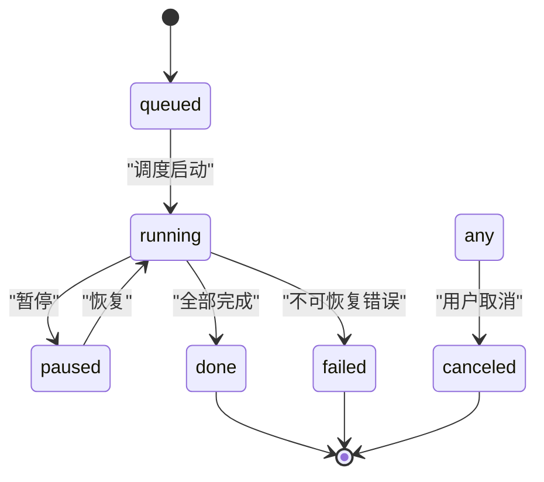
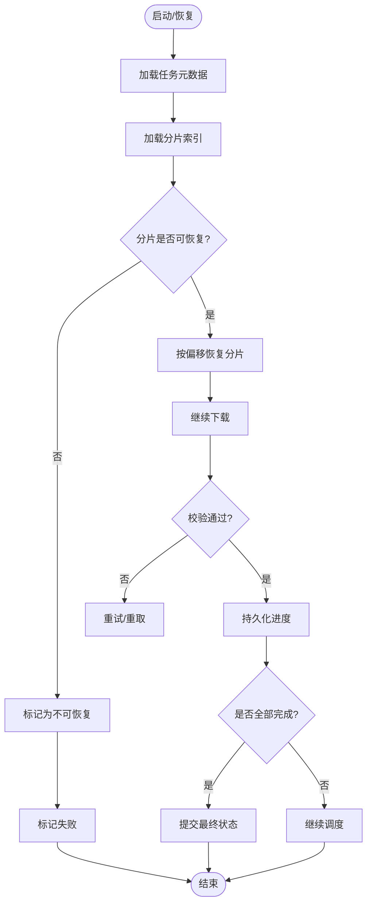
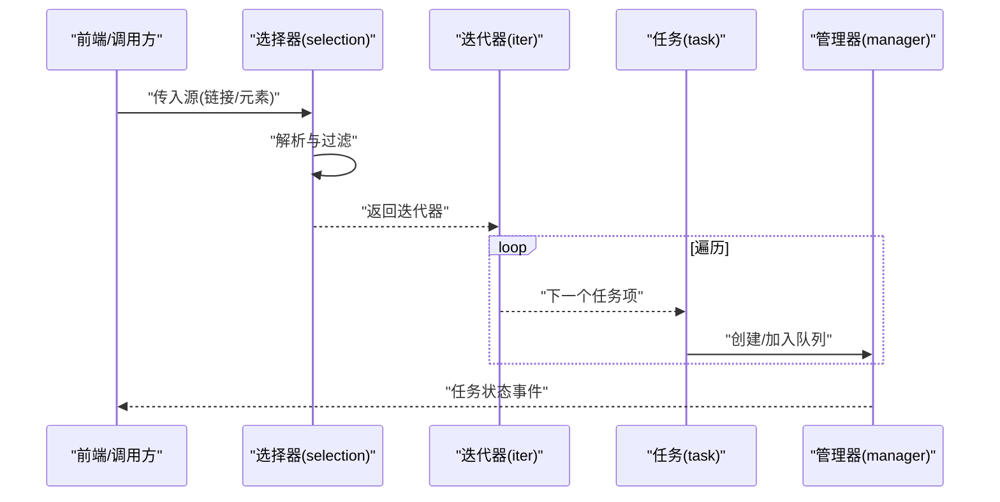
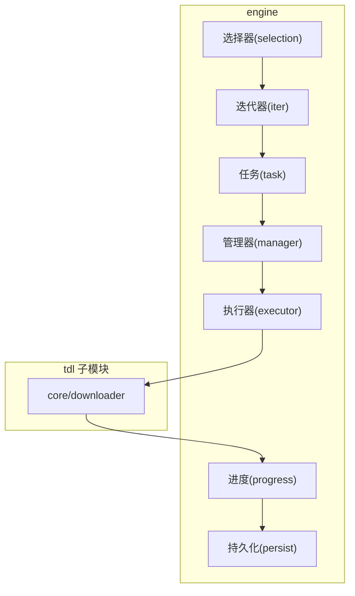
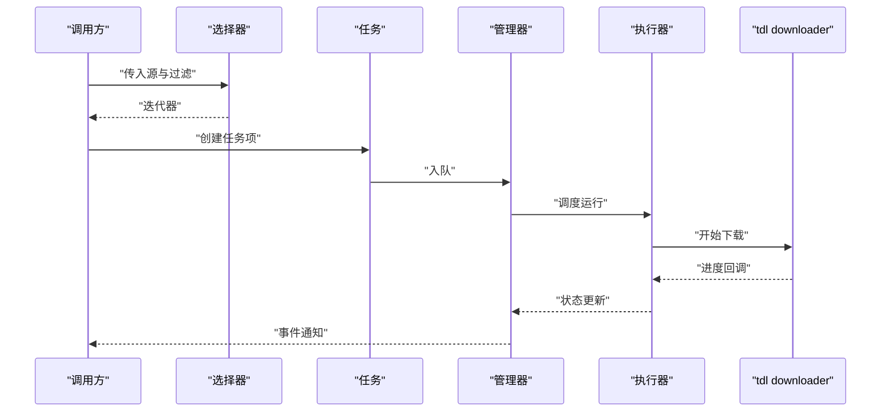
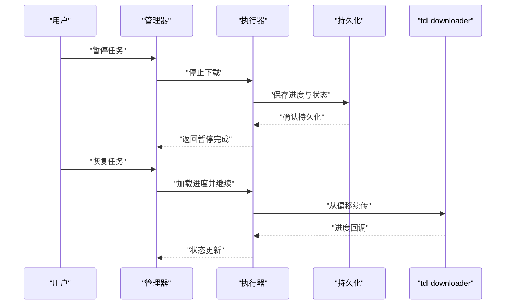
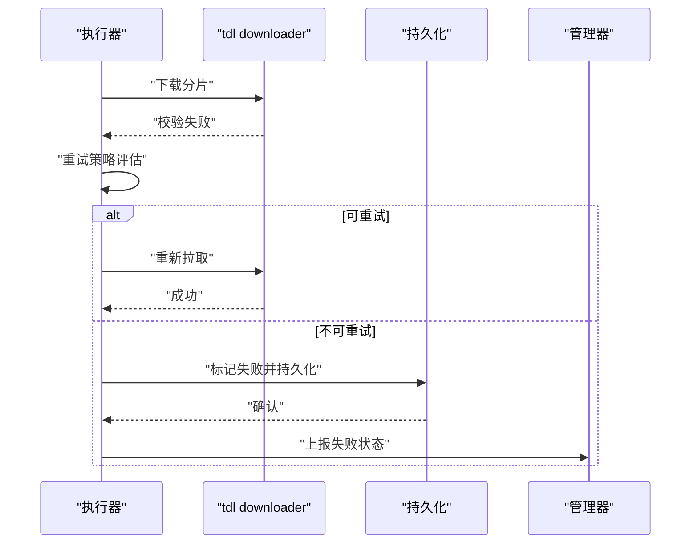

# 下载引擎状态机

<cite>
**本文引用的文件**   
- [src/internal/engine/task.go](file://src/internal/engine/task.go)
- [src/internal/engine/manager.go](file://src/internal/engine/manager.go)
- [src/internal/engine/progress.go](file://src/internal/engine/progress.go)
- [src/internal/engine/persist.go](file://src/internal/engine/persist.go)
- [src/internal/engine/selection.go](file://src/internal/engine/selection.go)
- [src/internal/engine/links.go](file://src/internal/engine/links.go)
- [src/internal/engine/executor.go](file://src/internal/engine/executor.go)
- [src/internal/engine/elem.go](file://src/internal/engine/elem.go)
- [src/internal/engine/iter.go](file://src/internal/engine/iter.go)
- [src/internal/store/resume_repo.go](file://src/internal/store/resume_repo.go)
- [src/internal/store/task_repo.go](file://src/internal/store/task_repo.go)
</cite>

## 概述
本文件聚焦 src/internal/engine/ 目录下的下载引擎，围绕以下目标展开：
- 任务状态机设计（queued/running/paused/done/failed/canceled）
- 断点续传机制（持久化、恢复与一致性）
- 选集下载逻辑（批量选择与调度）
- 与 tdl core/downloader 的复用关系（通过子模块引入与封装调用）

该引擎以“任务”为核心抽象，结合管理器、执行器、进度与持久化组件，形成可暂停、可恢复、可批量选择的下载流水线。

## 状态机设计
- 状态集合
  - queued：任务已入队，等待调度
  - running：正在执行下载
  - paused：被暂停，保留进度
  - done：完成
  - failed：失败
  - canceled：取消
- 状态转换规则
  - queued → running：调度器从队列取出并启动执行器
  - running → paused：用户或系统触发暂停，保存进度后进入暂停
  - paused → running：恢复时读取进度并继续执行
  - running → done：所有分片/元素下载成功
  - running → failed：不可恢复错误（网络、校验等）
  - any → canceled：用户主动取消，清理资源并落盘
- 关键约束
  - 同一任务在同一时刻仅处于一个状态
  - 进入 running 前必须确保上下文与资源可用
  - 进入 paused/done/failed/canceled 时必须持久化最终状态与进度

图示来源
- [src/internal/engine/task.go](file://src/internal/engine/task.go)
- [src/internal/engine/manager.go](file://src/internal/engine/manager.go)

章节来源
- [src/internal/engine/task.go](file://src/internal/engine/task.go)
- [src/internal/engine/manager.go](file://src/internal/engine/manager.go)

## 断点续传机制
- 核心思路
  - 将下载过程拆分为多个可独立恢复的分片/元素
  - 每个分片记录已下载字节数、偏移量、校验信息
  - 在进程重启或任务暂停/恢复时，从持久化存储恢复分片状态
- 持久化要点
  - 使用独立的恢复仓库（resume repo）按任务维度组织数据
  - 写入策略采用幂等更新，避免并发写冲突
  - 提交时机：分片完成、任务状态变更、定期快照
- 恢复流程
  - 启动时加载任务元数据与分片索引
  - 根据分片偏移重建下载上下文
  - 对已完成分片跳过，未完成分片从偏移处续传
- 一致性保障
  - 事务性提交：状态与分片元数据原子更新
  - 校验失败回滚：校验不通过则标记分片失败并重新拉取

图示来源
- [src/internal/engine/progress.go](file://src/internal/engine/progress.go)
- [src/internal/engine/persist.go](file://src/internal/engine/persist.go)
- [src/internal/store/resume_repo.go](file://src/internal/store/resume_repo.go)

章节来源
- [src/internal/engine/progress.go](file://src/internal/engine/progress.go)
- [src/internal/engine/persist.go](file://src/internal/engine/persist.go)
- [src/internal/store/resume_repo.go](file://src/internal/store/resume_repo.go)

## 选集下载逻辑
- 选集定义
  - 基于链接列表或元素集合进行筛选，支持范围、过滤、去重
  - 生成可执行的下载序列（迭代器），供调度器消费
- 处理流程
  - 解析输入（URL/列表/脚本结果）
  - 构建元素集合与索引
  - 应用筛选条件（类型、大小、时间等）
  - 输出有序的任务项，供任务创建与调度
- 性能优化
  - 惰性迭代：按需生成任务项，降低内存占用
  - 预计算索引：加速筛选与去重
  - 批处理：批量提交到任务队列，减少锁竞争

图示来源
- [src/internal/engine/selection.go](file://src/internal/engine/selection.go)
- [src/internal/engine/iter.go](file://src/internal/engine/iter.go)
- [src/internal/engine/task.go](file://src/internal/engine/task.go)
- [src/internal/engine/manager.go](file://src/internal/engine/manager.go)

章节来源
- [src/internal/engine/selection.go](file://src/internal/engine/selection.go)
- [src/internal/engine/iter.go](file://src/internal/engine/iter.go)
- [src/internal/engine/task.go](file://src/internal/engine/task.go)
- [src/internal/engine/manager.go](file://src/internal/engine/manager.go)

## 与 tdl 引擎的复用关系
- 集成方式
  - 通过 go.mod replace 引入 ref/tdl 子模块，禁止直接修改其代码
  - 在 engine 层封装 tdl 的 core/downloader 能力，提供统一接口
- 职责边界
  - engine：任务编排、状态机、持久化、选集与迭代
  - tdl core/downloader：底层传输、分片、重试、校验等实现细节
- 调用路径
  - 管理器创建任务后，委托执行器调用 tdl downloader
  - 进度回调由 downloader 上报至 engine，驱动状态机与持久化
- 版本管理
  - Go 版本由子模块钉住，保持构建一致性
  - 同步上游通过 git submodule update --remote

图示来源
- [src/internal/engine/manager.go](file://src/internal/engine/manager.go)
- [src/internal/engine/executor.go](file://src/internal/engine/executor.go)
- [src/internal/engine/task.go](file://src/internal/engine/task.go)
- [src/internal/engine/selection.go](file://src/internal/engine/selection.go)
- [src/internal/engine/iter.go](file://src/internal/engine/iter.go)
- [src/internal/engine/progress.go](file://src/internal/engine/progress.go)
- [src/internal/engine/persist.go](file://src/internal/engine/persist.go)

章节来源
- [src/internal/engine/manager.go](file://src/internal/engine/manager.go)
- [src/internal/engine/executor.go](file://src/internal/engine/executor.go)
- [src/internal/engine/task.go](file://src/internal/engine/task.go)
- [src/internal/engine/selection.go](file://src/internal/engine/selection.go)
- [src/internal/engine/iter.go](file://src/internal/engine/iter.go)
- [src/internal/engine/progress.go](file://src/internal/engine/progress.go)
- [src/internal/engine/persist.go](file://src/internal/engine/persist.go)

## 关键数据结构
- 任务（task）
  - 标识与元数据：ID、名称、来源、优先级
  - 状态字段：当前状态、错误码、统计信息
  - 生命周期钩子：创建、启动、暂停、恢复、完成、失败、取消
- 分片/元素（elem）
  - 分片索引、偏移、长度、校验值
  - 下载上下文：连接参数、重试策略
- 进度（progress）
  - 累计字节数、速率、耗时
  - 分片级进度映射
- 选择器（selection）
  - 输入源、过滤规则、排序策略
  - 迭代器接口：Next()、HasMore()
- 管理器（manager）
  - 任务池、调度策略、并发控制
  - 事件总线：状态变更、进度上报

章节来源
- [src/internal/engine/task.go](file://src/internal/engine/task.go)
- [src/internal/engine/elem.go](file://src/internal/engine/elem.go)
- [src/internal/engine/progress.go](file://src/internal/engine/progress.go)
- [src/internal/engine/selection.go](file://src/internal/engine/selection.go)
- [src/internal/engine/manager.go](file://src/internal/engine/manager.go)

## 时序图
- 任务创建与启动

图示来源
- [src/internal/engine/selection.go](file://src/internal/engine/selection.go)
- [src/internal/engine/task.go](file://src/internal/engine/task.go)
- [src/internal/engine/manager.go](file://src/internal/engine/manager.go)
- [src/internal/engine/executor.go](file://src/internal/engine/executor.go)

- 暂停与恢复

图示来源
- [src/internal/engine/manager.go](file://src/internal/engine/manager.go)
- [src/internal/engine/executor.go](file://src/internal/engine/executor.go)
- [src/internal/engine/persist.go](file://src/internal/engine/persist.go)

- 失败与重试

图示来源
- [src/internal/engine/executor.go](file://src/internal/engine/executor.go)
- [src/internal/engine/persist.go](file://src/internal/engine/persist.go)
- [src/internal/engine/manager.go](file://src/internal/engine/manager.go)