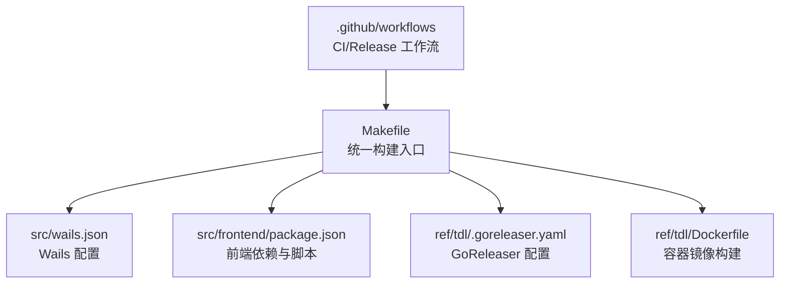
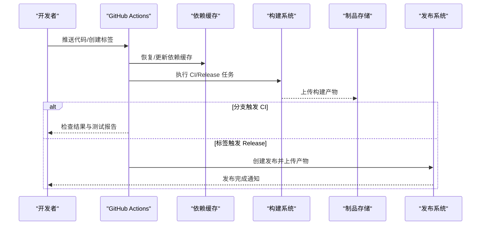
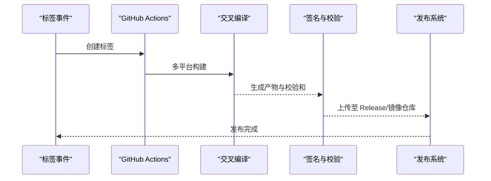
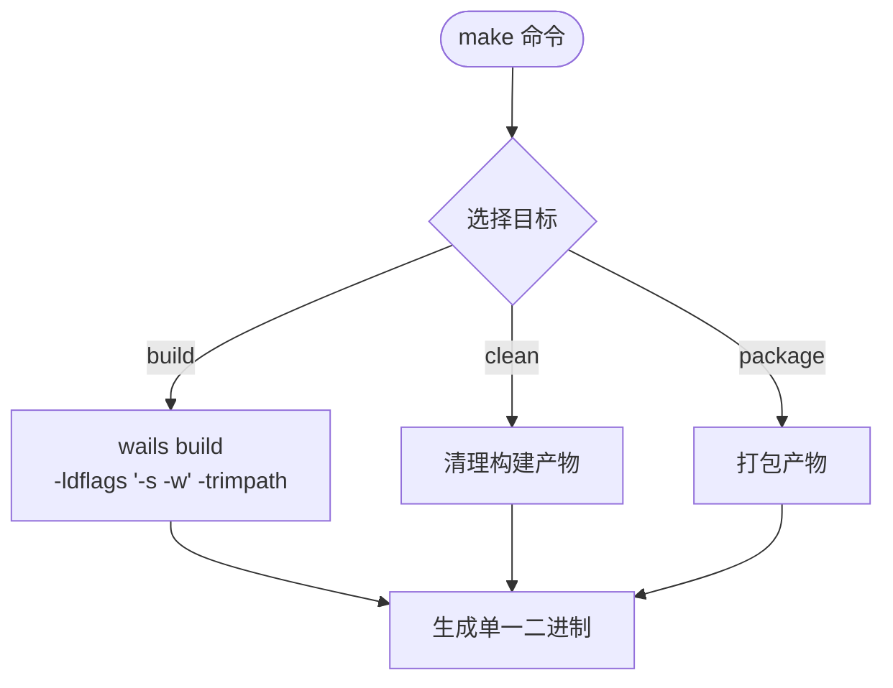
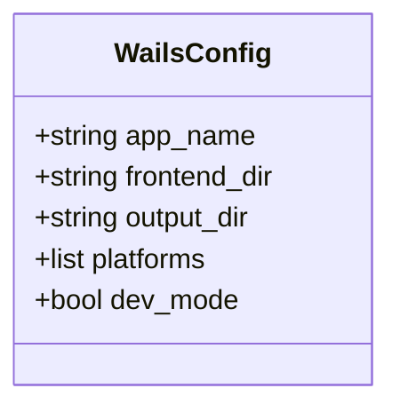
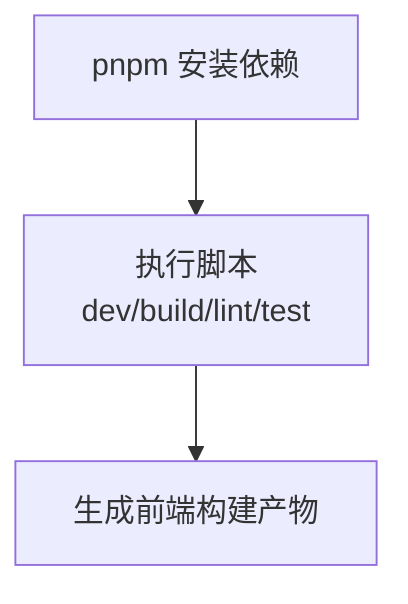
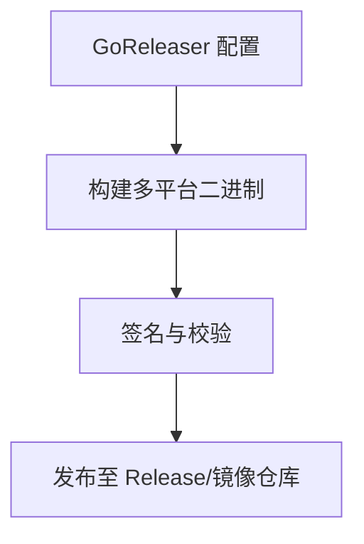
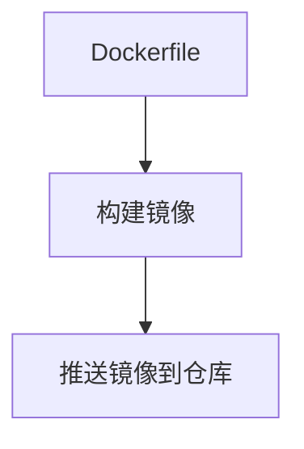
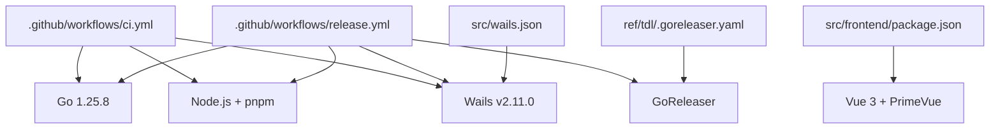

# CI/CD流水线

<cite>
**本文引用的文件**   
- [.github/workflows/ci.yml](file://.github/workflows/ci.yml)
- [.github/workflows/release.yml](file://.github/workflows/release.yml)
- [Makefile](file://Makefile)
- [src/wails.json](file://src/wails.json)
- [src/frontend/package.json](file://src/frontend/package.json)
- [ref/tdl/.goreleaser.yaml](file://ref/tdl/.goreleaser.yaml)
- [ref/tdl/Dockerfile](file://ref/tdl/Dockerfile)
</cite>

## 目录
1. [简介](#简介)
2. [项目结构](#项目结构)
3. [核心组件](#核心组件)
4. [架构总览](#架构总览)
5. [详细组件分析](#详细组件分析)
6. [依赖关系分析](#依赖关系分析)
7. [性能与稳定性考虑](#性能与稳定性考虑)
8. [故障排查指南](#故障排查指南)
9. [结论](#结论)
10. [附录](#附录)

## 简介
本仓库采用 GitHub Actions 作为 CI/CD 平台，结合 Wails v2.11.0 构建跨平台桌面应用，前端基于 Vue 3 + PrimeVue + Pinia + vue-router，后端使用 Go。子模块 ref/tdl 通过 go.mod replace 引入，禁止直接修改，仅允许 git submodule update --remote 同步上游。Go 版本由子模块钉住为 1.25.8，Wails 构建命令固定为 wails build -ldflags "-s -w" -trimpath，产出单一二进制。CI 流程覆盖依赖安装、类型检查、测试、静态检查、构建产物打包与发布等阶段；Release 流程负责打标签、生成发行物并上传至 Release 或容器镜像仓库。

## 项目结构
- .github/workflows：GitHub Actions 工作流定义（CI、Release）
- src：Wails 应用源码（Go 后端 + Vue 前端）
- ref/tdl：Git 子模块（核心引擎），提供 CLI、核心库与文档
- Makefile：统一构建入口（封装 Wails 构建参数）
- 其他：文档、图片、脚本等

**图示来源** 
- [.github/workflows/ci.yml](file://.github/workflows/ci.yml)
- [.github/workflows/release.yml](file://.github/workflows/release.yml)
- [Makefile](file://Makefile)
- [src/wails.json](file://src/wails.json)
- [src/frontend/package.json](file://src/frontend/package.json)
- [ref/tdl/.goreleaser.yaml](file://ref/tdl/.goreleaser.yaml)
- [ref/tdl/Dockerfile](file://ref/tdl/Dockerfile)

**章节来源**
- [.github/workflows/ci.yml](file://.github/workflows/ci.yml)
- [.github/workflows/release.yml](file://.github/workflows/release.yml)
- [Makefile](file://Makefile)
- [src/wails.json](file://src/wails.json)
- [src/frontend/package.json](file://src/frontend/package.json)
- [ref/tdl/.goreleaser.yaml](file://ref/tdl/.goreleaser.yaml)
- [ref/tdl/Dockerfile](file://ref/tdl/Dockerfile)

## 核心组件
- CI 工作流：触发条件、环境准备、依赖缓存、代码质量检查、测试、构建与制品归档
- Release 工作流：版本标签触发、多平台交叉编译、产物签名与校验、发布到 Release/镜像仓库
- Makefile：封装 Wails 构建命令，确保 ldflags、trimpath 等参数一致
- Wails 配置：指定前端资源路径、输出名称、平台目标
- 前端依赖：pnpm 管理依赖，脚本包含构建、预览、类型检查等
- GoReleaser：用于 ref/tdl 子模块的 Go 二进制打包与发布
- Dockerfile：用于构建子模块镜像（可选）

**章节来源**
- [.github/workflows/ci.yml](file://.github/workflows/ci.yml)
- [.github/workflows/release.yml](file://.github/workflows/release.yml)
- [Makefile](file://Makefile)
- [src/wails.json](file://src/wails.json)
- [src/frontend/package.json](file://src/frontend/package.json)
- [ref/tdl/.goreleaser.yaml](file://ref/tdl/.goreleaser.yaml)
- [ref/tdl/Dockerfile](file://ref/tdl/Dockerfile)

## 架构总览
下图展示了从代码提交到构建产物的端到端流程，包括 CI 与 Release 两条主线，以及前端、后端与子模块的协作关系。

**图示来源** 
- [.github/workflows/ci.yml](file://.github/workflows/ci.yml)
- [.github/workflows/release.yml](file://.github/workflows/release.yml)

## 详细组件分析

### CI 工作流（ci.yml）
- 触发条件：默认分支推送、Pull Request
- 环境准备：设置 Go 版本、Node.js 版本、pnpm
- 依赖缓存：Go 模块缓存、前端依赖缓存
- 代码质量：TypeScript/Vue 类型检查、Go lint
- 测试：前端单元测试、Go 测试
- 构建：调用 Makefile 进行 Wails 构建，生成跨平台二进制
- 制品：将构建产物归档以便后续下载或调试

```mermaid
flowchart TD
Start(["开始"]) --> Trigger["触发事件<br/>push/pr"]
Trigger --> Setup["设置环境<br/>Go/Node/pnpm"]
Setup --> Cache["恢复依赖缓存"]
Cache --> Lint["代码质量检查<br/>前端+Go"]
Lint --> Test["运行测试<br/>前端+Go"]
Test --> Build["执行构建<br/>Makefile -> Wails"]
Build --> Artifact["上传制品"]
Artifact --> End(["结束"])
```

**图示来源** 
- [.github/workflows/ci.yml](file://.github/workflows/ci.yml)

**章节来源**
- [.github/workflows/ci.yml](file://.github/workflows/ci.yml)

### Release 工作流（release.yml）
- 触发条件：创建标签（如 v*）
- 环境准备：同 CI，增加签名与发布权限
- 构建：多平台交叉编译（Windows/macOS/Linux）
- 校验：生成校验和、签名验证
- 发布：上传至 GitHub Releases，可选推送镜像到容器仓库
- 通知：发布完成后发送通知

**图示来源** 
- [.github/workflows/release.yml](file://.github/workflows/release.yml)

**章节来源**
- [.github/workflows/release.yml](file://.github/workflows/release.yml)

### Makefile（统一构建入口）
- 封装 Wails 构建命令，确保 ldflags 与 trimpath 参数一致
- 支持不同目标平台（windows/darwin/linux）
- 可集成前端构建、清理、打包等步骤

**图示来源** 
- [Makefile](file://Makefile)

**章节来源**
- [Makefile](file://Makefile)

### Wails 配置（wails.json）
- 指定前端资源路径、输出名称、平台目标
- 与 Makefile 配合确保构建一致性

**图示来源** 
- [src/wails.json](file://src/wails.json)

**章节来源**
- [src/wails.json](file://src/wails.json)

### 前端依赖（package.json）
- pnpm 管理依赖，包含 Vue 3、PrimeVue、Pinia、vue-router
- 脚本：dev、build、lint、test 等
- 与 CI/Release 中的 Node.js 版本与 pnpm 缓存配合

**图示来源** 
- [src/frontend/package.json](file://src/frontend/package.json)

**章节来源**
- [src/frontend/package.json](file://src/frontend/package.json)

### GoReleaser（ref/tdl/.goreleaser.yaml）
- 定义 Go 二进制打包规则、校验和生成、签名
- 支持多平台构建与发布
- 与 CI/Release 工作流集成，实现自动化发布

**图示来源** 
- [ref/tdl/.goreleaser.yaml](file://ref/tdl/.goreleaser.yaml)

**章节来源**
- [ref/tdl/.goreleaser.yaml](file://ref/tdl/.goreleaser.yaml)

### Dockerfile（ref/tdl/Dockerfile）
- 定义容器镜像构建步骤
- 可用于子模块的独立部署或测试环境

**图示来源** 
- [ref/tdl/Dockerfile](file://ref/tdl/Dockerfile)

**章节来源**
- [ref/tdl/Dockerfile](file://ref/tdl/Dockerfile)

## 依赖关系分析
- CI/Release 工作流依赖：Go、Node.js、pnpm、Wails CLI、GoReleaser（可选）
- 前端依赖：Vue 3、PrimeVue、Pinia、vue-router、TypeScript
- 后端依赖：Go 1.25.8（由子模块钉住）、Wails v2.11.0
- 子模块依赖：ref/tdl 通过 go.mod replace 引入，禁止直接修改

**图示来源** 
- [.github/workflows/ci.yml](file://.github/workflows/ci.yml)
- [.github/workflows/release.yml](file://.github/workflows/release.yml)
- [src/frontend/package.json](file://src/frontend/package.json)
- [src/wails.json](file://src/wails.json)
- [ref/tdl/.goreleaser.yaml](file://ref/tdl/.goreleaser.yaml)

**章节来源**
- [.github/workflows/ci.yml](file://.github/workflows/ci.yml)
- [.github/workflows/release.yml](file://.github/workflows/release.yml)
- [src/frontend/package.json](file://src/frontend/package.json)
- [src/wails.json](file://src/wails.json)
- [ref/tdl/.goreleaser.yaml](file://ref/tdl/.goreleaser.yaml)

## 性能与稳定性考虑
- 依赖缓存：充分利用 GitHub Actions 缓存机制，加速构建
- 并行执行：在可能情况下并行运行测试与构建任务
- 资源优化：Wails 构建使用 -ldflags "-s -w" -trimpath 减小二进制体积
- 错误隔离：CI 与 Release 分离，避免相互影响
- 版本锁定：Go 版本由子模块钉住，确保构建一致性

[本节为通用指导，不直接分析具体文件]

## 故障排查指南
- 构建失败：检查 Go/Node.js 版本是否与配置一致，确认依赖缓存是否有效
- 测试失败：查看测试日志，定位具体失败的用例与环境问题
- 发布失败：检查标签格式、权限配置、签名密钥是否正确
- 子模块问题：确保未直接修改 ref/tdl，仅通过 git submodule update --remote 同步上游

**章节来源**
- [.github/workflows/ci.yml](file://.github/workflows/ci.yml)
- [.github/workflows/release.yml](file://.github/workflows/release.yml)
- [Makefile](file://Makefile)
- [src/wails.json](file://src/wails.json)
- [src/frontend/package.json](file://src/frontend/package.json)
- [ref/tdl/.goreleaser.yaml](file://ref/tdl/.goreleaser.yaml)
- [ref/tdl/Dockerfile](file://ref/tdl/Dockerfile)

## 结论
本项目通过 GitHub Actions 实现了完整的 CI/CD 流水线，涵盖代码质量检查、测试、构建与发布全流程。结合 Wails 与 Vue 技术栈，确保了跨平台桌面应用的开发与交付效率。子模块 ref/tdl 的严格管理与版本锁定，进一步提升了构建的稳定性和可重复性。建议持续优化依赖缓存、并行化任务与错误监控，以提升整体流水线性能与可靠性。

[本节为总结性内容，不直接分析具体文件]

## 附录
- 最佳实践：保持依赖版本锁定、使用缓存、并行化任务、分离 CI/Release
- 常见问题：版本不一致、权限不足、缓存失效、子模块冲突
- 扩展方向：集成代码覆盖率、安全扫描、自动化文档生成

[本节为补充信息，不直接分析具体文件]