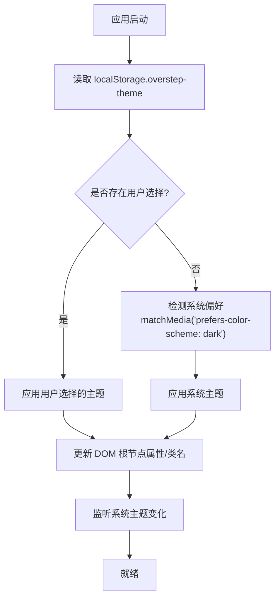
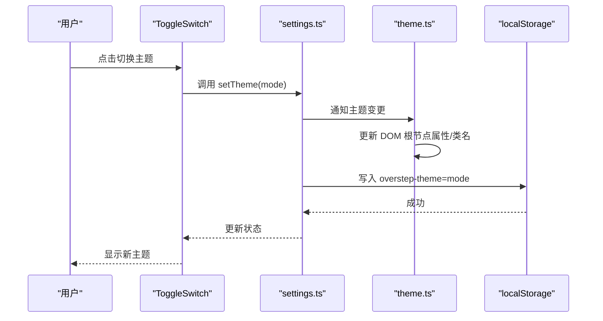
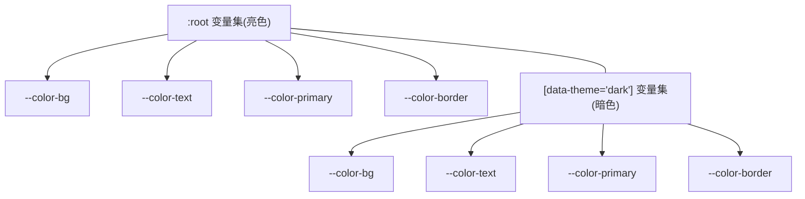
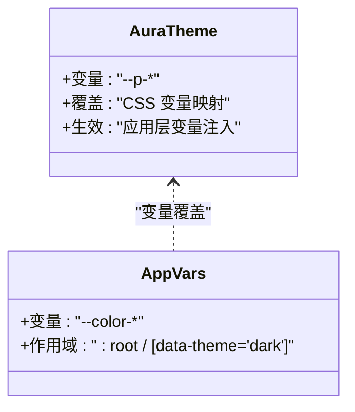
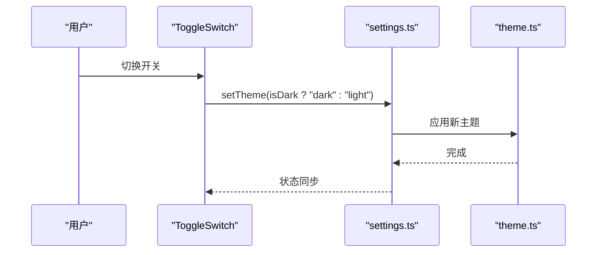

# 主题切换系统

<cite>
**本文引用的文件**   
- [theme.ts](file://src/frontend/src/theme.ts)
- [style.css](file://src/frontend/src/style.css)
- [settings.ts](file://src/frontend/src/stores/settings.ts)
</cite>

## 目录
- 概述
- 系统偏好检测
- localStorage 持久化
- CSS 变量定义
- PrimeVue Aura 主题适配
- ToggleSwitch 控件实现
- 各页面主题适配检查点

## 概述
本章节聚焦于前端主题切换的完整实现，围绕以下核心文件展开：
- theme.ts：主题模式状态、系统偏好检测与主题切换逻辑
- style.css：全局 CSS 变量与暗色/亮色样式规则
- settings.ts：Pinia Store，负责主题的初始化、持久化与 UI 暴露

整体目标：
- 启动时自动检测系统偏好（深色/浅色）
- 将用户手动选择持久化到 localStorage（键名 overstep-theme）
- 通过 CSS 变量驱动界面颜色，确保所有组件基于变量渲染
- 使用 PrimeVue 4.3.3 的 Aura 主题，并与其变量体系对齐
- 提供 ToggleSwitch 滑动开关作为主题切换入口

**章节来源**
- [theme.ts](file://src/frontend/src/theme.ts)
- [style.css](file://src/frontend/src/style.css)
- [settings.ts](file://src/frontend/src/stores/settings.ts)

## 系统偏好检测
- 检测机制
  - 使用 matchMedia('(prefers-color-scheme: dark)') 监听系统级深色模式
  - 首次加载时根据系统偏好设置初始主题
  - 监听系统变化事件，动态响应系统主题切换
- 优先级策略
  - 若 localStorage 中存在 overstep-theme，则以用户选择为准
  - 否则回退到系统偏好
- 变更传播
  - 主题变化后更新 DOM 根节点的数据属性或类名，触发 CSS 变量切换
  - 同步更新 Pinia store 中的主题状态，供 UI 组件读取

**图表来源**
- [theme.ts](file://src/frontend/src/theme.ts)
- [settings.ts](file://src/frontend/src/stores/settings.ts)

**章节来源**
- [theme.ts](file://src/frontend/src/theme.ts)
- [settings.ts](file://src/frontend/src/stores/settings.ts)

## localStorage 持久化
- 存储键名
  - overstep-theme：保存用户选择的主题值（如 "dark" 或 "light"）
- 读写时机
  - 用户切换主题后立即写入
  - 应用启动时优先读取该值以恢复上次选择
- 容错处理
  - 读取失败或格式异常时回退到系统偏好
  - 写入失败时静默忽略，避免阻塞主流程
- 数据一致性
  - 主题状态变更后，store 与 DOM 保持同步
  - 避免重复写入与不必要的重绘

**图表来源**
- [settings.ts](file://src/frontend/src/stores/settings.ts)
- [theme.ts](file://src/frontend/src/theme.ts)

**章节来源**
- [settings.ts](file://src/frontend/src/stores/settings.ts)
- [theme.ts](file://src/frontend/src/theme.ts)

## CSS 变量定义
- 设计原则
  - 所有颜色通过 CSS 变量声明，禁止硬编码颜色值
  - 按语义命名变量（如 --color-bg、--color-text、--color-primary 等）
  - 为暗色与亮色分别定义变量集合，便于一键切换
- 变量组织
  - 在 :root 下定义默认（亮色）变量
  - 在 [data-theme="dark"] 或 .dark 下覆盖为暗色变量
- 影响范围
  - 全局背景、文本、边框、阴影、按钮、输入框、卡片等
  - 第三方组件（PrimeVue）通过变量覆盖保持一致外观

**图表来源**
- [style.css](file://src/frontend/src/style.css)

**章节来源**
- [style.css](file://src/frontend/src/style.css)

## PrimeVue Aura 主题适配
- 版本与主题
  - 使用 PrimeVue 4.3.3 的 Aura 主题
- 适配策略
  - 通过 CSS 变量覆盖 Aura 内置变量，统一品牌色与明暗对比
  - 在暗色模式下调整关键变量（背景、文本、边框、高亮色）
- 注意事项
  - 避免直接修改 PrimeVue 源码，仅通过变量覆盖
  - 确保组件在不同主题下可读性与对比度符合无障碍标准

**图表来源**
- [style.css](file://src/frontend/src/style.css)

**章节来源**
- [style.css](file://src/frontend/src/style.css)

## ToggleSwitch 控件实现
- 交互入口
  - 使用 PrimeVue 的 ToggleSwitch 组件作为主题切换控件
- 行为说明
  - 打开表示深色模式，关闭表示浅色模式
  - 切换时调用 store.setTheme()，触发持久化与 DOM 更新
- 可访问性
  - 保留原生语义与键盘操作支持
  - 提供清晰的 aria-label 与提示文案

**图表来源**
- [settings.ts](file://src/frontend/src/stores/settings.ts)
- [theme.ts](file://src/frontend/src/theme.ts)

**章节来源**
- [settings.ts](file://src/frontend/src/stores/settings.ts)
- [theme.ts](file://src/frontend/src/theme.ts)

## 各页面主题适配检查点
为确保全页面主题一致，建议在各页面进行如下检查：
- 背景与文本
  - 确认背景色与文本色均使用 CSS 变量
  - 暗色模式下文本对比度足够
- 边框与分割线
  - 边框颜色随主题切换正确变化
- 卡片与面板
  - 卡片背景、阴影与边框在暗色模式下清晰可见
- 表单与输入
  - 输入框背景、边框、焦点态在两种主题下均可读
- 图标与媒体
  - 图标颜色与主题一致；图片水印或叠加层不遮挡内容
- 第三方组件
  - 表格、对话框、下拉菜单等遵循主题变量
- 调试建议
  - 在浏览器开发者工具中切换 data-theme 属性验证样式
  - 使用无障碍检查器验证对比度

**章节来源**
- [style.css](file://src/frontend/src/style.css)