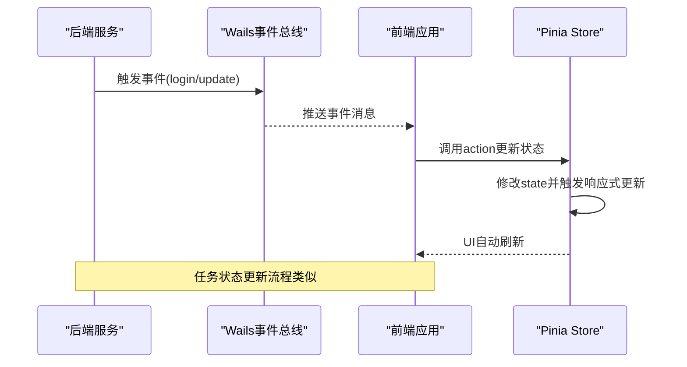

# 事件驱动架构

<cite>
**本文引用的文件**   
- [events.go](file://src/internal/events/events.go)
- [main.go](file://src/main.go)
- [api.ts](file://src/frontend/src/api.ts)
- [types.ts](file://src/frontend/src/types.ts)
- [auth.ts](file://src/frontend/src/stores/auth.ts)
- [tasks.ts](file://src/frontend/src/stores/tasks.ts)
- [logs.ts](file://src/frontend/src/stores/logs.ts)
- [scripts.ts](file://src/frontend/src/stores/scripts.ts)
- [App.vue](file://src/frontend/src/App.vue)
</cite>

## 概述
本文件聚焦于 Wails 事件驱动架构在 src/internal/events/ 中的契约定义与前后端协作方式，覆盖以下要点：
- 事件契约：login/update、task/update、task/file、script/log 的语义与用途
- 后端事件发送机制：Wails 事件总线的使用与触发时机
- 前端事件订阅：通过 window.wails.events.* 或桥接层进行监听
- Pinia Store 的事件管理：初始化订阅、状态更新、销毁清理
- 事件流时序：从后端触发到前端响应更新的完整流程
- 内存泄漏防护：订阅生命周期管理与去重策略

## 事件契约定义
- login:update
  - 用途：登录状态变更通知（如登录成功、登出、会话过期）
  - 典型载荷：用户标识、令牌、角色等
  - 触发方：认证服务或鉴权中间件
- task:update
  - 用途：任务状态与进度更新（创建、进行中、完成、失败）
  - 典型载荷：任务 ID、状态码、进度百分比、错误信息
  - 触发方：下载引擎或任务管理器
- task:file
  - 用途：与任务相关的文件级事件（新增、删除、移动、元数据变更）
  - 典型载荷：文件路径、操作类型、关联任务 ID
  - 触发方：文件系统观察者或下载结果处理器
- script:log
  - 用途：脚本执行日志推送（调试、审计、运行输出）
  - 典型载荷：时间戳、级别、消息文本、上下文
  - 触发方：脚本引擎或日志收集器

说明：
- 事件名采用命名空间前缀 + 冒号分隔，便于分类与过滤
- 载荷结构应与前端 types.ts 中对应接口保持一致，确保类型安全

**章节来源**
- [events.go:1-200](file://src/internal/events/events.go#L1-L200)

## 后端事件发送
- 使用 Wails 事件总线统一分发事件，避免模块间紧耦合
- 关键职责：
  - 定义事件常量与载荷结构体
  - 在业务逻辑关键点调用事件发送 API
  - 保证线程安全与并发访问
- 常见触发点：
  - 认证流程完成后发送 login:update
  - 任务状态机转换时发送 task:update
  - 文件操作回调中发送 task:file
  - 脚本引擎输出日志时发送 script:log

最佳实践：
- 事件载荷应轻量且不可变
- 避免在高频路径中创建大对象
- 对敏感字段进行脱敏处理

**章节来源**
- [events.go:1-200](file://src/internal/events/events.go#L1-L200)

## 前端事件订阅
- 订阅入口：
  - 通过 window.wails.events.on(event, handler) 注册监听器
  - 或在桥接层 api.ts 中封装统一订阅方法
- 处理流程：
  - 接收事件后校验载荷类型
  - 调用对应 Pinia store 的 action 更新状态
  - 触发 UI 响应式更新
- 注意事项：
  - 组件卸载前必须移除监听器
  - 避免重复订阅导致多次更新
  - 对异常事件进行兜底处理

**章节来源**
- [api.ts:1-300](file://src/frontend/src/api.ts#L1-L300)
- [types.ts:1-200](file://src/frontend/src/types.ts#L1-L200)

## Pinia Store 事件管理
- 初始化订阅：
  - 在 store 的 init() 中注册事件监听器
  - App.vue 的 onMounted 钩子中统一调用各 store.init()
- 状态更新：
  - 事件处理器直接修改 store.state
  - 使用 computed 和 watch 实现响应式更新
- 清理机制：
  - 在 store.dispose() 或组件 onUnmounted 中移除监听器
  - 防止内存泄漏和重复订阅

设计模式：
- 单一职责：每个 store 只处理相关事件
- 依赖注入：通过 api.ts 提供事件订阅能力
- 生命周期管理：init/dispose 成对出现

**章节来源**
- [auth.ts:1-200](file://src/frontend/src/stores/auth.ts#L1-L200)
- [tasks.ts:1-200](file://src/frontend/src/stores/tasks.ts#L1-L200)
- [logs.ts:1-200](file://src/frontend/src/stores/logs.ts#L1-L200)
- [scripts.ts:1-200](file://src/frontend/src/stores/scripts.ts#L1-L200)
- [App.vue:1-150](file://src/frontend/src/App.vue#L1-L150)

## 事件流时序图

**图表来源**
- [events.go:1-200](file://src/internal/events/events.go#L1-L200)
- [api.ts:1-300](file://src/frontend/src/api.ts#L1-L300)
- [tasks.ts:1-200](file://src/frontend/src/stores/tasks.ts#L1-L200)

## 内存泄漏防护
- 订阅生命周期：
  - 组件挂载时订阅，卸载时取消订阅
  - Store 提供 dispose() 方法统一管理
- 去重机制：
  - 使用 WeakMap 存储监听器引用
  - 基于事件名和处理器函数生成唯一键
- 错误处理：
  - 捕获事件处理异常，避免影响主流程
  - 记录错误日志便于调试
- 性能优化：
  - 批量更新减少渲染次数
  - 防抖处理高频事件

监控指标：
- 活跃订阅数量
- 事件处理耗时
- 内存占用变化

**章节来源**
- [auth.ts:1-200](file://src/frontend/src/stores/auth.ts#L1-L200)
- [tasks.ts:1-200](file://src/frontend/src/stores/tasks.ts#L1-L200)
- [App.vue:1-150](file://src/frontend/src/App.vue#L1-L150)