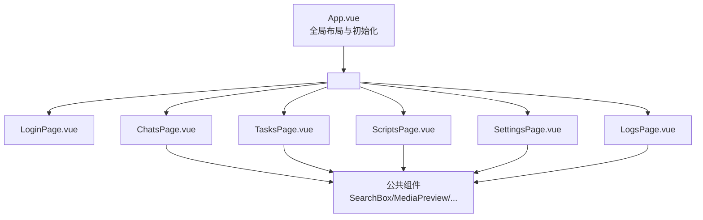
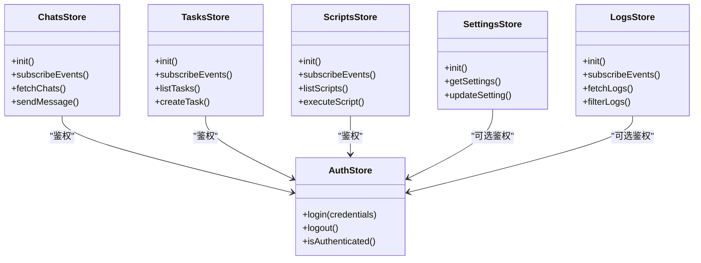
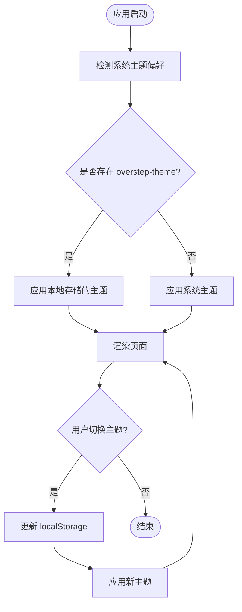

# 前端页面架构

<cite>
**本文引用的文件**   
- [router.ts](file://src/frontend/src/router.ts)
- [App.vue](file://src/frontend/src/App.vue)
- [LoginPage.vue](file://src/frontend/src/pages/LoginPage.vue)
- [ChatsPage.vue](file://src/frontend/src/pages/ChatsPage.vue)
- [TasksPage.vue](file://src/frontend/src/pages/TasksPage.vue)
- [ScriptsPage.vue](file://src/frontend/src/pages/ScriptsPage.vue)
- [SettingsPage.vue](file://src/frontend/src/pages/SettingsPage.vue)
- [LogsPage.vue](file://src/frontend/src/pages/LogsPage.vue)
- [auth.ts](file://src/frontend/src/stores/auth.ts)
- [chats.ts](file://src/frontend/src/stores/chats.ts)
- [tasks.ts](file://src/frontend/src/stores/tasks.ts)
- [scripts.ts](file://src/frontend/src/stores/scripts.ts)
- [settings.ts](file://src/frontend/src/stores/settings.ts)
- [logs.ts](file://src/frontend/src/stores/logs.ts)
- [api.ts](file://src/frontend/src/api.ts)
- [types.ts](file://src/frontend/src/types.ts)
- [theme.ts](file://src/frontend/src/theme.ts)
- [style.css](file://src/frontend/src/style.css)
</cite>

## 概述
本文件聚焦于 src/frontend/src/pages/ 下的六大页面（Login / Chats / Tasks / Scripts / Settings / Logs），从路由配置、组件层级、Pinia Store 依赖、响应式布局策略与主题适配实现五个维度进行系统化梳理，帮助读者快速理解前端页面的组织方式与运行机制。

## 路由配置
- 路由入口由 router.ts 统一注册，采用 vue-router 的 createRouter + createWebHashHistory（或 History）模式，将六个页面映射到对应路径：
  - Login：登录页，通常作为默认或受保护前的入口
  - Chats：聊天列表与对话管理
  - Tasks：任务管理与进度展示
  - Scripts：脚本管理与执行
  - Settings：系统设置与偏好
  - Logs：日志查看与检索
- 导航守卫与权限控制：
  - 未登录访问受保护路由时重定向至 Login
  - 已登录访问 Login 时重定向至首页（如 Chats）
- 路由元信息：
  - 可为各路由设置 title、icon、是否需要认证等元数据，便于布局渲染与菜单生成
- 动态路由与懒加载：
  - 页面组件通过 import() 懒加载，减少首屏体积
  - 可结合路由参数实现详情页（如任务详情、脚本详情）

章节来源
- [router.ts](file://src/frontend/src/router.ts)

## 页面组件层级
- 顶层容器 App.vue：
  - 负责全局布局（侧边栏/顶部导航/内容区）、路由视图 <router-view/> 渲染、全局事件总线与 store 初始化
  - onMounted 中调用各 store.init()，完成事件订阅与连接建立
- 页面级组件（pages/*）：
  - 每个页面遵循三段式结构：<template> → <script setup lang="ts"> → <style scoped>
  - 页面内部再组合业务子组件（如搜索框、工具栏、预览面板等），并通过 Pinia store 管理状态
- 公共组件（components/*）：
  - 复用性高的 UI 片段（如 SearchBox、MediaPreview、DialogListPanel、NewTaskDialog、AppIcon、MediaToolbar）在各页面中按需引入
- 组件层级关系示例（以 Chats 为例）：
  - ChatsPage 包含：
    - 左侧会话列表（使用 DialogListPanel）
    - 右侧消息区域（使用 MediaPreview、MediaToolbar）
    - 顶部搜索与筛选（使用 SearchBox）
    - 新建会话弹窗（使用 NewTaskDialog）

图表来源
- [App.vue](file://src/frontend/src/App.vue)
- [ChatsPage.vue](file://src/frontend/src/pages/ChatsPage.vue)
- [TasksPage.vue](file://src/frontend/src/pages/TasksPage.vue)
- [ScriptsPage.vue](file://src/frontend/src/pages/ScriptsPage.vue)
- [SettingsPage.vue](file://src/frontend/src/pages/SettingsPage.vue)
- [LogsPage.vue](file://src/frontend/src/pages/LogsPage.vue)

章节来源
- [App.vue](file://src/frontend/src/App.vue)
- [LoginPage.vue](file://src/frontend/src/pages/LoginPage.vue)
- [ChatsPage.vue](file://src/frontend/src/pages/ChatsPage.vue)
- [TasksPage.vue](file://src/frontend/src/pages/TasksPage.vue)
- [ScriptsPage.vue](file://src/frontend/src/pages/ScriptsPage.vue)
- [SettingsPage.vue](file://src/frontend/src/pages/SettingsPage.vue)
- [LogsPage.vue](file://src/frontend/src/pages/LogsPage.vue)

## Pinia Store 依赖关系
- Store 职责划分：
  - auth：用户认证状态、登录态、鉴权信息
  - chats：会话列表、消息流、连接状态
  - tasks：任务列表、进度、状态机
  - scripts：脚本列表、执行结果
  - settings：应用设置、主题、偏好
  - logs：日志条目、过滤、分页
- 生命周期与事件订阅：
  - 各 store 在 init() 中完成事件订阅（如 WebSocket、后端事件通道）
  - App.vue 在 onMounted 中统一调用各 store.init()，确保连接就绪后再渲染页面
- 页面与 Store 的依赖关系：
  - LoginPage 依赖 auth
  - ChatsPage 依赖 chats（可能依赖 auth 做鉴权）
  - TasksPage 依赖 tasks（可能依赖 auth）
  - ScriptsPage 依赖 scripts（可能依赖 auth）
  - SettingsPage 依赖 settings（可能依赖 auth）
  - LogsPage 依赖 logs（可能依赖 auth）

图表来源
- [auth.ts](file://src/frontend/src/stores/auth.ts)
- [chats.ts](file://src/frontend/src/stores/chats.ts)
- [tasks.ts](file://src/frontend/src/stores/tasks.ts)
- [scripts.ts](file://src/frontend/src/stores/scripts.ts)
- [settings.ts](file://src/frontend/src/stores/settings.ts)
- [logs.ts](file://src/frontend/src/stores/logs.ts)

章节来源
- [auth.ts](file://src/frontend/src/stores/auth.ts)
- [chats.ts](file://src/frontend/src/stores/chats.ts)
- [tasks.ts](file://src/frontend/src/stores/tasks.ts)
- [scripts.ts](file://src/frontend/src/stores/scripts.ts)
- [settings.ts](file://src/frontend/src/stores/settings.ts)
- [logs.ts](file://src/frontend/src/stores/logs.ts)
- [App.vue](file://src/frontend/src/App.vue)

## 响应式布局策略
- 栅格与断点：
  - 基于 PrimeVue 的栅格系统与 CSS 媒体查询，定义移动端、平板、桌面端的断点
  - 侧边栏在小屏下折叠为抽屉式导航，在大屏下常驻显示
- 弹性布局：
  - 使用 Flexbox/Grid 实现自适应列数与高度
  - 内容区域根据视口高度自动计算滚动区域
- 触摸与交互：
  - 移动端优化点击区域与手势支持
  - 长列表使用虚拟滚动或分页加载提升性能
- 页面内布局策略：
  - Chats：左右分栏（列表/详情），小屏切换为全屏单栏
  - Tasks：卡片网格，按屏幕宽度自适应列数
  - Scripts：表格+操作按钮，小屏改为堆叠布局
  - Settings：表单分节，小屏纵向排列
  - Logs：时间线列表，支持横向滚动与筛选面板折叠

章节来源
- [style.css](file://src/frontend/src/style.css)
- [ChatsPage.vue](file://src/frontend/src/pages/ChatsPage.vue)
- [TasksPage.vue](file://src/frontend/src/pages/TasksPage.vue)
- [ScriptsPage.vue](file://src/frontend/src/pages/ScriptsPage.vue)
- [SettingsPage.vue](file://src/frontend/src/pages/SettingsPage.vue)
- [LogsPage.vue](file://src/frontend/src/pages/LogsPage.vue)

## 主题适配实现
- 主题源：
  - theme.ts 提供主题配置（颜色、字体、阴影等），并暴露切换 API
  - style.css 中通过 CSS 变量定义全局样式变量，组件样式引用这些变量
- 检测与持久化：
  - 初始检测系统偏好：matchMedia('(prefers-color-scheme: dark)')
  - 手动切换后写入 localStorage（键名 overstep-theme）
  - 页面刷新时优先读取本地存储，其次回退到系统偏好
- 组件适配：
  - 所有 UI 组件基于 CSS 变量实现主题切换，禁止硬编码颜色值
  - 主题切换控件使用 ToggleSwitch 滑动开关，提供即时反馈
- 运行时切换流程：

图表来源
- [theme.ts](file://src/frontend/src/theme.ts)
- [style.css](file://src/frontend/src/style.css)

章节来源
- [theme.ts](file://src/frontend/src/theme.ts)
- [style.css](file://src/frontend/src/style.css)

## 公共组件复用
- 组件清单与用途：
  - AppIcon：统一图标资源与尺寸规范
  - SearchBox：通用搜索输入框，支持防抖与清空
  - MediaPreview：媒体文件预览（图片/视频/文档）
  - MediaToolbar：媒体操作工具栏（下载/分享/删除）
  - DialogListPanel：对话框式列表面板（用于选择器、确认框）
  - NewTaskDialog：新建任务弹窗，封装表单验证与提交
- 复用策略：
  - 通过 props 传递数据与回调，保持组件高内聚低耦合
  - 使用 slots 扩展插槽内容，增强灵活性
  - 样式隔离：每个组件使用 <style scoped> 避免样式污染
- 页面中的使用示例：
  - ChatsPage：使用 SearchBox 过滤会话，MediaPreview 展示消息附件
  - TasksPage：使用 DialogListPanel 展示任务详情，NewTaskDialog 创建任务
  - ScriptsPage：使用 AppIcon 表示脚本类型，MediaToolbar 提供执行操作
  - SettingsPage：使用 SearchBox 快速定位设置项
  - LogsPage：使用 MediaPreview 预览日志附件（如有）

章节来源
- [LoginPage.vue](file://src/frontend/src/pages/LoginPage.vue)
- [ChatsPage.vue](file://src/frontend/src/pages/ChatsPage.vue)
- [TasksPage.vue](file://src/frontend/src/pages/TasksPage.vue)
- [ScriptsPage.vue](file://src/frontend/src/pages/ScriptsPage.vue)
- [SettingsPage.vue](file://src/frontend/src/pages/SettingsPage.vue)
- [LogsPage.vue](file://src/frontend/src/pages/LogsPage.vue)