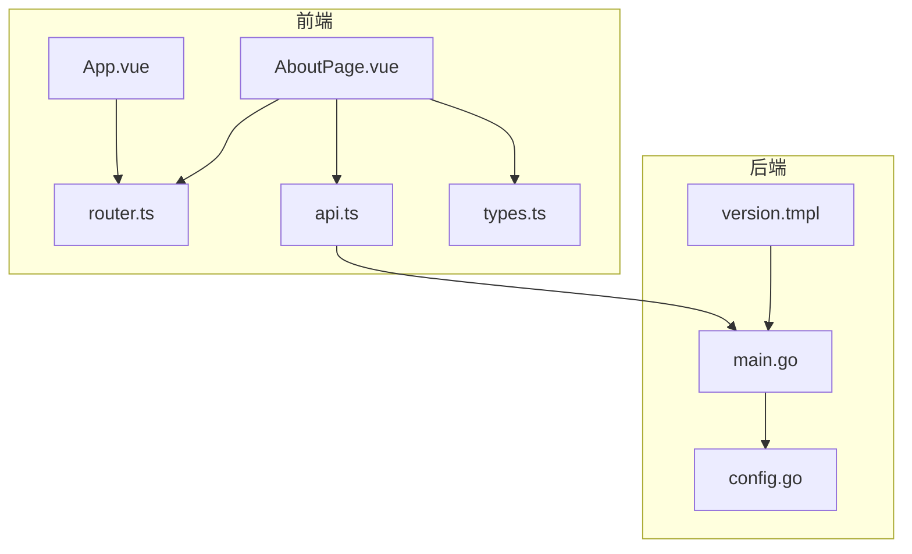
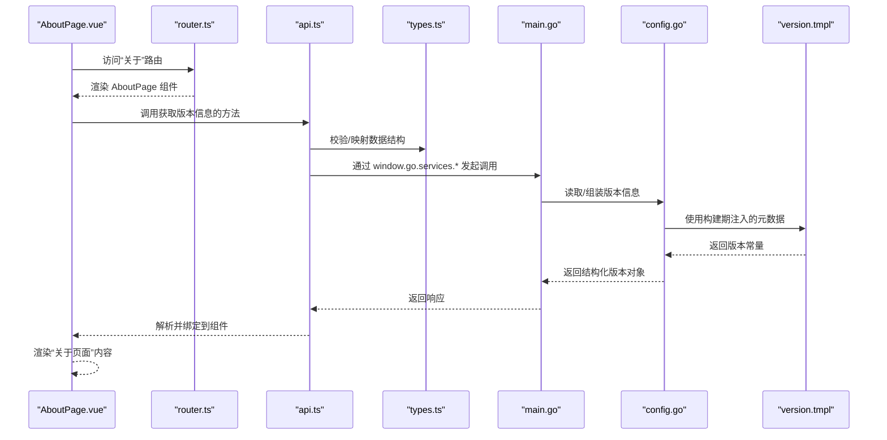
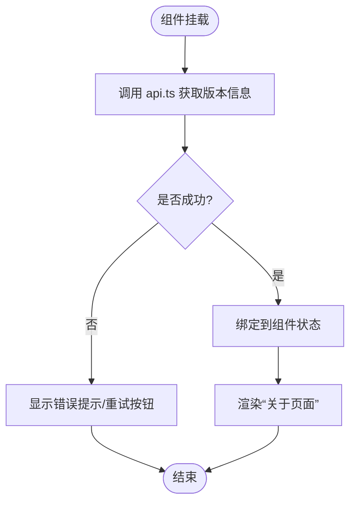
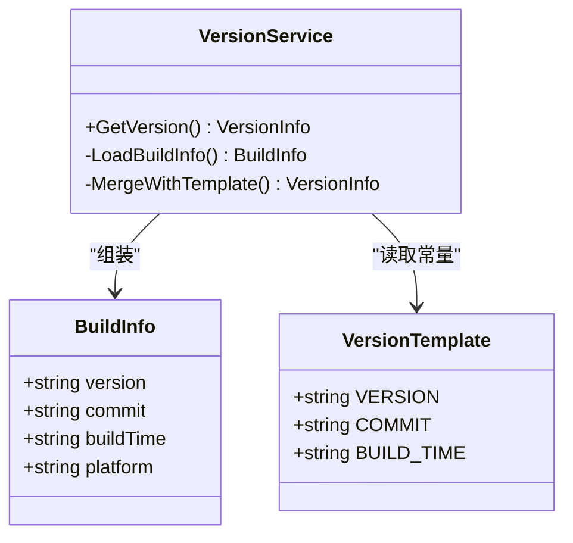
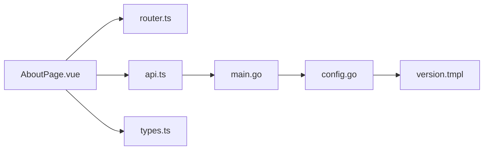

# 关于页面

<cite>
**本文引用的文件**   
- [AboutPage.vue](file://src/frontend/src/pages/AboutPage.vue)
- [App.vue](file://src/frontend/src/App.vue)
- [router.ts](file://src/frontend/src/router.ts)
- [types.ts](file://src/frontend/src/types.ts)
- [api.ts](file://src/frontend/src/api.ts)
- [main.go](file://src/main.go)
- [config.go](file://src/internal/config/config.go)
- [version.tmpl](file://ref/tdl/cmd/version.tmpl)
</cite>

## 目录
1. [简介](#简介)
2. [项目结构](#项目结构)
3. [核心组件](#核心组件)
4. [架构总览](#架构总览)
5. [详细组件分析](#详细组件分析)
6. [依赖分析](#依赖分析)
7. [性能考虑](#性能考虑)
8. [故障排查指南](#故障排查指南)
9. [结论](#结论)
10. [附录](#附录)

## 简介
本章节聚焦“关于页面”的功能与实现，说明其在应用中的定位、数据来源、渲染流程以及与后端版本信息的集成方式。该页面主要用于展示应用名称、版本号、构建信息与相关说明，是用户了解应用状态与版本的重要入口。

## 项目结构
“关于页面”属于前端路由中的一个独立页面，位于 pages 目录下，通过路由配置挂载到应用主框架中。其数据来源于后端暴露的版本信息，并通过统一的 API 封装进行获取。

图表来源 
- [AboutPage.vue](file://src/frontend/src/pages/AboutPage.vue)
- [router.ts](file://src/frontend/src/router.ts)
- [api.ts](file://src/frontend/src/api.ts)
- [types.ts](file://src/frontend/src/types.ts)
- [App.vue](file://src/frontend/src/App.vue)
- [main.go](file://src/main.go)
- [config.go](file://src/internal/config/config.go)
- [version.tmpl](file://ref/tdl/cmd/version.tmpl)

章节来源
- [AboutPage.vue](file://src/frontend/src/pages/AboutPage.vue)
- [router.ts](file://src/frontend/src/router.ts)
- [api.ts](file://src/frontend/src/api.ts)
- [types.ts](file://src/frontend/src/types.ts)
- [App.vue](file://src/frontend/src/App.vue)
- [main.go](file://src/main.go)
- [config.go](file://src/internal/config/config.go)
- [version.tmpl](file://ref/tdl/cmd/version.tmpl)

## 核心组件
- AboutPage.vue：负责“关于页面”的模板、脚本与样式，呈现应用基本信息与版本详情。
- router.ts：定义路由映射，将“关于”路径与 AboutPage 组件关联。
- api.ts：封装 window.go.services.* 调用，统一前后端类型契约（由 types.ts 定义）。
- types.ts：定义前后端交互的数据结构，确保 Go 结构体 JSON tag 变更时前端同步更新。
- App.vue：应用启动时初始化各 store，并加载路由视图。
- main.go：Wails 应用入口，注册服务与方法，提供版本信息接口。
- config.go：读取或生成版本与构建信息，供后端服务返回给前端。
- version.tmpl：构建期注入版本与构建元数据的模板文件。

章节来源
- [AboutPage.vue](file://src/frontend/src/pages/AboutPage.vue)
- [router.ts](file://src/frontend/src/router.ts)
- [api.ts](file://src/frontend/src/api.ts)
- [types.ts](file://src/frontend/src/types.ts)
- [App.vue](file://src/frontend/src/App.vue)
- [main.go](file://src/main.go)
- [config.go](file://src/internal/config/config.go)
- [version.tmpl](file://ref/tdl/cmd/version.tmpl)

## 架构总览
“关于页面”的数据流遵循“前端请求 → 后端服务 → 版本信息聚合 → 返回前端渲染”的模式。前端通过 api.ts 调用后端服务方法，后端从配置或构建期注入的信息中聚合版本数据，并以统一结构返回。

图表来源 
- [AboutPage.vue](file://src/frontend/src/pages/AboutPage.vue)
- [router.ts](file://src/frontend/src/router.ts)
- [api.ts](file://src/frontend/src/api.ts)
- [types.ts](file://src/frontend/src/types.ts)
- [main.go](file://src/main.go)
- [config.go](file://src/internal/config/config.go)
- [version.tmpl](file://ref/tdl/cmd/version.tmpl)

## 详细组件分析

### AboutPage.vue 组件
- 职责：展示应用名称、版本号、构建时间、许可证等“关于”信息。
- 数据源：通过 api.ts 调用后端服务获取版本信息；类型约束来自 types.ts。
- 生命周期：在组件挂载后触发数据获取，错误处理与空值保护需完善。
- 主题适配：基于 CSS 变量，避免硬编码颜色；遵循三段式结构规范。

图表来源 
- [AboutPage.vue](file://src/frontend/src/pages/AboutPage.vue)
- [api.ts](file://src/frontend/src/api.ts)
- [types.ts](file://src/frontend/src/types.ts)

章节来源
- [AboutPage.vue](file://src/frontend/src/pages/AboutPage.vue)
- [api.ts](file://src/frontend/src/api.ts)
- [types.ts](file://src/frontend/src/types.ts)

### 路由与导航
- 路由定义：在 router.ts 中将“关于”路径映射到 AboutPage 组件。
- 导航行为：点击导航项进入“关于页面”，保持应用整体布局一致。

章节来源
- [router.ts](file://src/frontend/src/router.ts)
- [App.vue](file://src/frontend/src/App.vue)

### 后端版本信息聚合
- 入口：main.go 注册服务方法，对外暴露版本查询接口。
- 配置：config.go 读取或生成版本与构建信息，结合构建期注入的模板常量。
- 模板：version.tmpl 在构建阶段注入版本、提交哈希、构建时间等元数据。

图表来源 
- [main.go](file://src/main.go)
- [config.go](file://src/internal/config/config.go)
- [version.tmpl](file://ref/tdl/cmd/version.tmpl)

章节来源
- [main.go](file://src/main.go)
- [config.go](file://src/internal/config/config.go)
- [version.tmpl](file://ref/tdl/cmd/version.tmpl)

## 依赖分析
- 前端依赖：AboutPage.vue 依赖 router.ts（路由）、api.ts（服务调用）、types.ts（类型定义）。
- 后端依赖：main.go 依赖 config.go（版本信息），config.go 依赖构建期注入的 version.tmpl。
- 外部依赖：Wails v2.11.0 作为桌面壳框架，Go 版本由子模块钉住为 1.25.8。

图表来源 
- [AboutPage.vue](file://src/frontend/src/pages/AboutPage.vue)
- [router.ts](file://src/frontend/src/router.ts)
- [api.ts](file://src/frontend/src/api.ts)
- [types.ts](file://src/frontend/src/types.ts)
- [main.go](file://src/main.go)
- [config.go](file://src/internal/config/config.go)
- [version.tmpl](file://ref/tdl/cmd/version.tmpl)

章节来源
- [AboutPage.vue](file://src/frontend/src/pages/AboutPage.vue)
- [router.ts](file://src/frontend/src/router.ts)
- [api.ts](file://src/frontend/src/api.ts)
- [types.ts](file://src/frontend/src/types.ts)
- [main.go](file://src/main.go)
- [config.go](file://src/internal/config/config.go)
- [version.tmpl](file://ref/tdl/cmd/version.tmpl)

## 性能考虑
- 版本信息为静态元数据，建议在前端缓存一次，避免重复请求。
- 若版本信息包含大量构建日志或附件，应分页或懒加载。
- 后端聚合版本信息时应尽量轻量，避免阻塞主线程。

## 故障排查指南
- 页面空白或无数据：检查 api.ts 调用是否成功，确认后端服务已注册版本接口。
- 版本信息显示异常：核对 config.go 与 version.tmpl 的常量是否正确注入。
- 类型不匹配：确保 types.ts 与后端结构体 JSON tag 保持一致。
- 路由无法跳转：检查 router.ts 的路径与组件导入是否正确。

章节来源
- [api.ts](file://src/frontend/src/api.ts)
- [types.ts](file://src/frontend/src/types.ts)
- [config.go](file://src/internal/config/config.go)
- [version.tmpl](file://ref/tdl/cmd/version.tmpl)
- [router.ts](file://src/frontend/src/router.ts)

## 结论
“关于页面”作为应用的基础信息展示页，实现了前后端协作的版本信息查询与渲染。通过清晰的组件职责、统一的服务调用与类型契约，保证了可维护性与扩展性。后续可在此基础上增加更多元数据（如许可证、贡献者列表）以提升用户体验。

## 附录
- 构建命令：wails build -ldflags "-s -w" -trimpath，产出单一二进制。
- 前端技术栈：Vue 3.5.13 + PrimeVue 4.3.3（Aura 主题）+ Pinia + vue-router，pnpm 管理依赖。
- 主题切换：默认检测系统偏好，手动切换后持久化至 localStorage（键名 overstep-theme）。
- 事件订阅：在 Pinia store 的 init() 中完成，App.vue onMounted 统一调用各 store.init()。