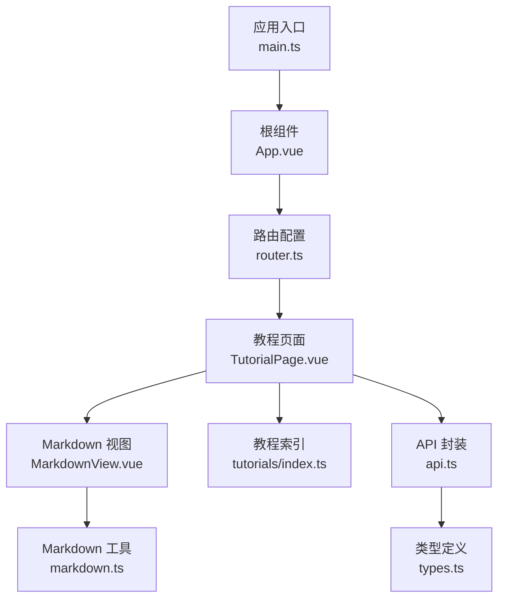
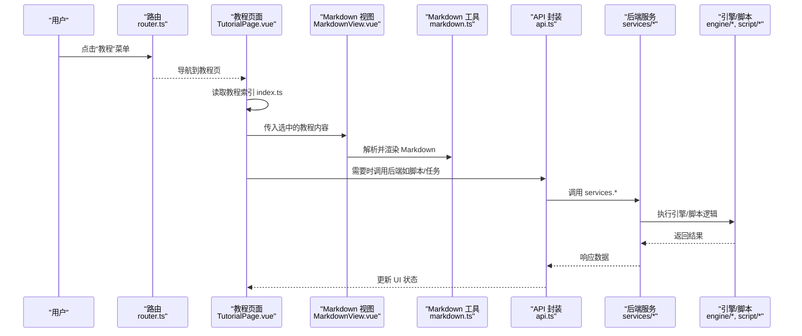
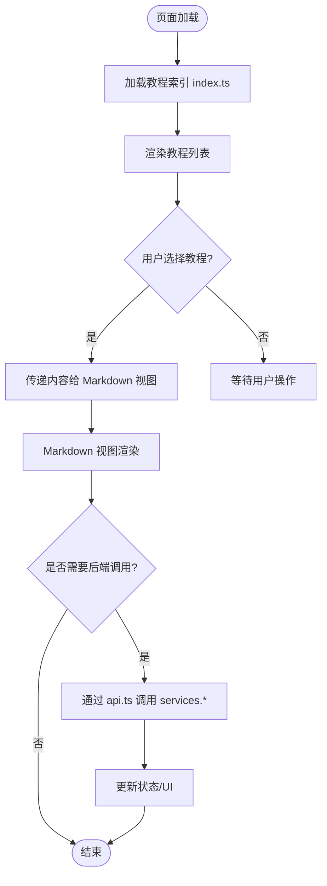
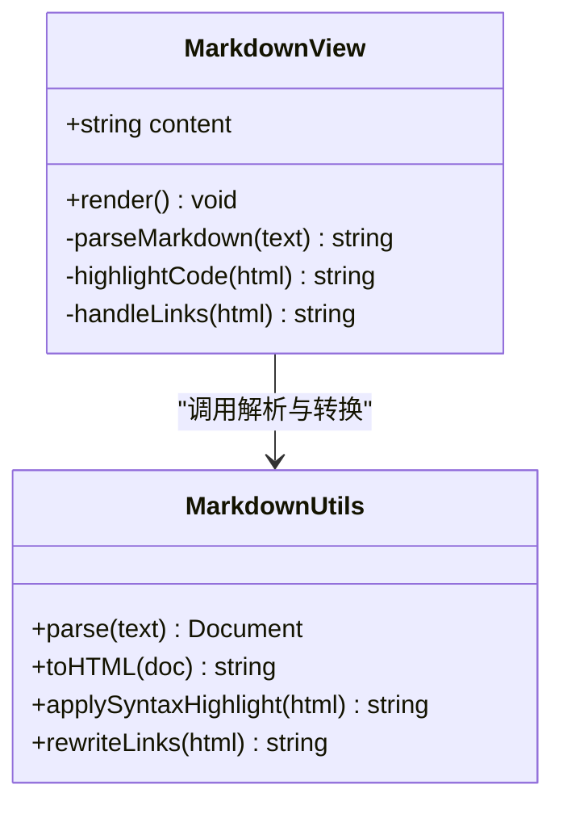
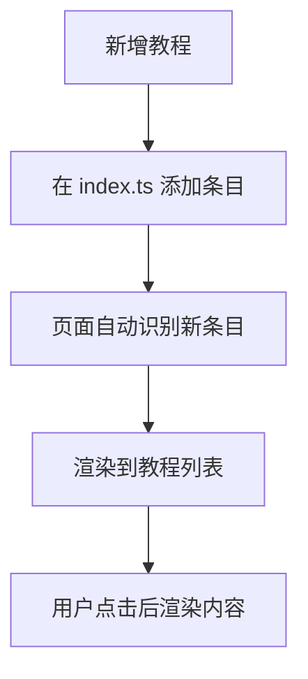
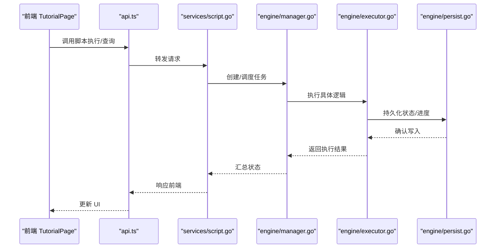
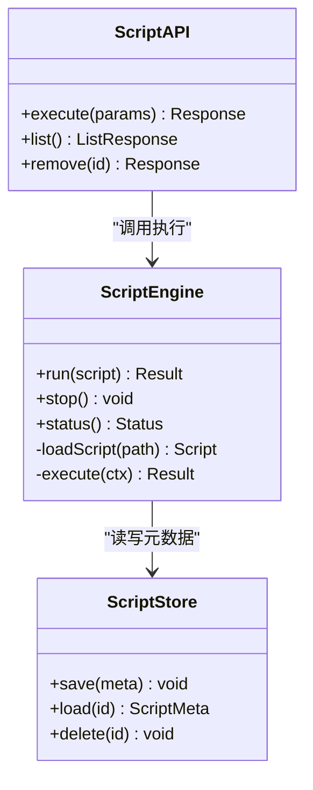
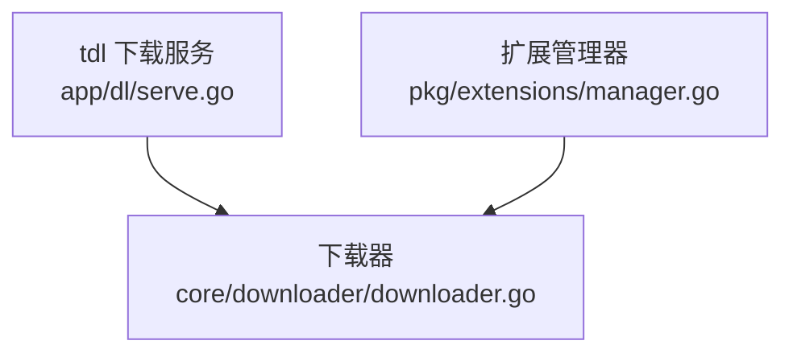
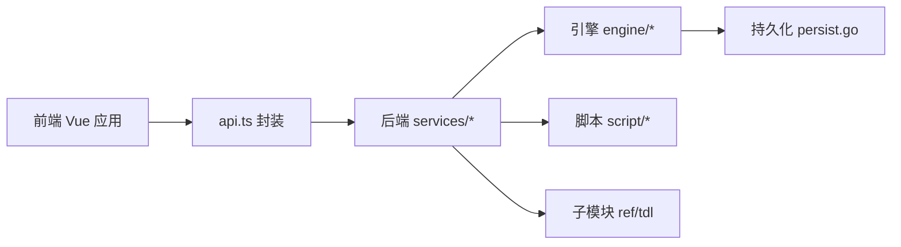

# 教程系统

<cite>
**本文引用的文件**   
- [src/frontend/src/pages/TutorialPage.vue](file://src/frontend/src/pages/TutorialPage.vue)
- [src/frontend/src/content/tutorials/index.ts](file://src/frontend/src/content/tutorials/index.ts)
- [src/frontend/src/components/MarkdownView.vue](file://src/frontend/src/components/MarkdownView.vue)
- [src/frontend/src/utils/markdown.ts](file://src/frontend/src/utils/markdown.ts)
- [src/frontend/src/router.ts](file://src/frontend/src/router.ts)
- [src/frontend/src/App.vue](file://src/frontend/src/App.vue)
- [src/frontend/src/main.ts](file://src/frontend/src/main.ts)
- [src/frontend/src/api.ts](file://src/frontend/src/api.ts)
- [src/frontend/src/types.ts](file://src/frontend/src/types.ts)
- [src/internal/engine/manager.go](file://src/internal/engine/manager.go)
- [src/internal/engine/task.go](file://src/internal/engine/task.go)
- [src/internal/engine/executor.go](file://src/internal/engine/executor.go)
- [src/internal/engine/links.go](file://src/internal/engine/links.go)
- [src/internal/engine/progress.go](file://src/internal/engine/progress.go)
- [src/internal/engine/iter.go](file://src/internal/engine/iter.go)
- [src/internal/engine/persist.go](file://src/internal/engine/persist.go)
- [src/internal/engine/selection.go](file://src/internal/engine/selection.go)
- [src/internal/services/script.go](file://src/internal/services/script.go)
- [src/internal/script/engine.go](file://src/internal/script/engine.go)
- [src/internal/script/store.go](file://src/internal/script/store.go)
- [src/internal/scriptapi/scriptapi.go](file://src/internal/scriptapi/scriptapi.go)
- [ref/tdl/app/dl/serve.go](file://ref/tdl/app/dl/serve.go)
- [ref/tdl/core/downloader/downloader.go](file://ref/tdl/core/downloader/downloader.go)
- [ref/tdl/pkg/extensions/manager.go](file://ref/tdl/pkg/extensions/manager.go)
</cite>

## 目录
1. [简介](#简介)
2. [项目结构](#项目结构)
3. [核心组件](#核心组件)
4. [架构总览](#架构总览)
5. [详细组件分析](#详细组件分析)
6. [依赖关系分析](#依赖关系分析)
7. [性能考虑](#性能考虑)
8. [故障排查指南](#故障排查指南)
9. [结论](#结论)
10. [附录](#附录)

## 简介
本教程系统为跨平台桌面应用（Wails + Vue 3）中的“教程”模块，负责在应用内展示、导航与渲染教程内容。教程内容由 Markdown 文档构成，前端通过路由与页面组件加载并渲染，同时与后端服务进行必要的数据交互（如脚本执行、任务状态等）。系统遵循作者规范：Vue 三段式组件、主题基于 CSS 变量、事件订阅在 store 初始化中完成、登录采用 channel + 事件驱动、ChatService 懒启动与断线重建等。

## 项目结构
教程系统主要位于前端 src/frontend 目录，核心包括：
- 教程页面与路由：TutorialPage.vue、router.ts
- 教程内容管理：content/tutorials/index.ts
- Markdown 渲染：components/MarkdownView.vue、utils/markdown.ts
- 前后端契约：api.ts、types.ts
- 应用入口与挂载：main.ts、App.vue

**图表来源** 
- [src/frontend/src/main.ts](file://src/frontend/src/main.ts)
- [src/frontend/src/App.vue](file://src/frontend/src/App.vue)
- [src/frontend/src/router.ts](file://src/frontend/src/router.ts)
- [src/frontend/src/pages/TutorialPage.vue](file://src/frontend/src/pages/TutorialPage.vue)
- [src/frontend/src/components/MarkdownView.vue](file://src/frontend/src/components/MarkdownView.vue)
- [src/frontend/src/utils/markdown.ts](file://src/frontend/src/utils/markdown.ts)
- [src/frontend/src/content/tutorials/index.ts](file://src/frontend/src/content/tutorials/index.ts)
- [src/frontend/src/api.ts](file://src/frontend/src/api.ts)
- [src/frontend/src/types.ts](file://src/frontend/src/types.ts)

**章节来源**
- [src/frontend/src/main.ts](file://src/frontend/src/main.ts)
- [src/frontend/src/App.vue](file://src/frontend/src/App.vue)
- [src/frontend/src/router.ts](file://src/frontend/src/router.ts)
- [src/frontend/src/pages/TutorialPage.vue](file://src/frontend/src/pages/TutorialPage.vue)
- [src/frontend/src/components/MarkdownView.vue](file://src/frontend/src/components/MarkdownView.vue)
- [src/frontend/src/utils/markdown.ts](file://src/frontend/src/utils/markdown.ts)
- [src/frontend/src/content/tutorials/index.ts](file://src/frontend/src/content/tutorials/index.ts)
- [src/frontend/src/api.ts](file://src/frontend/src/api.ts)
- [src/frontend/src/types.ts](file://src/frontend/src/types.ts)

## 核心组件
- 教程页面 TutorialPage.vue：负责教程列表、选择与渲染控制，按规范使用 <template>/<script setup lang="ts">/<style scoped> 三段式结构。
- Markdown 视图 MarkdownView.vue：接收 Markdown 文本或资源路径，调用 markdown.ts 进行解析与渲染。
- 教程索引 tutorials/index.ts：集中声明教程条目（标题、路径、分类等），便于路由与页面动态生成。
- Markdown 工具 markdown.ts：提供 Markdown 解析、语法高亮、链接处理等能力。
- API 封装 api.ts：统一通过 window.go.services.* 调用后端服务，类型契约由 types.ts 约束。

**章节来源**
- [src/frontend/src/pages/TutorialPage.vue](file://src/frontend/src/pages/TutorialPage.vue)
- [src/frontend/src/components/MarkdownView.vue](file://src/frontend/src/components/MarkdownView.vue)
- [src/frontend/src/content/tutorials/index.ts](file://src/frontend/src/content/tutorials/index.ts)
- [src/frontend/src/utils/markdown.ts](file://src/frontend/src/utils/markdown.ts)
- [src/frontend/src/api.ts](file://src/frontend/src/api.ts)
- [src/frontend/src/types.ts](file://src/frontend/src/types.ts)

## 架构总览
教程系统的前端层通过路由进入教程页面，页面从教程索引获取条目，选择后交由 Markdown 视图渲染。必要时，页面通过 api.ts 调用后端服务（例如脚本执行、任务查询等），后端服务再与引擎、持久化存储交互。

**图表来源** 
- [src/frontend/src/router.ts](file://src/frontend/src/router.ts)
- [src/frontend/src/pages/TutorialPage.vue](file://src/frontend/src/pages/TutorialPage.vue)
- [src/frontend/src/components/MarkdownView.vue](file://src/frontend/src/components/MarkdownView.vue)
- [src/frontend/src/utils/markdown.ts](file://src/frontend/src/utils/markdown.ts)
- [src/frontend/src/api.ts](file://src/frontend/src/api.ts)
- [src/internal/services/script.go](file://src/internal/services/script.go)
- [src/internal/engine/manager.go](file://src/internal/engine/manager.go)
- [src/internal/script/engine.go](file://src/internal/script/engine.go)

## 详细组件分析

### 教程页面 TutorialPage.vue
- 职责：展示教程列表、切换选中项、将内容传递给 Markdown 视图；必要时触发后端调用（如运行脚本、查看任务进度）。
- 交互模式：遵循 Vue 三段式结构；事件订阅在 store 的 init() 中完成，App.vue onMounted 统一调用各 store.init()。
- 主题适配：基于 CSS 变量实现，避免硬编码颜色；主题切换控件使用 ToggleSwitch。

**图表来源** 
- [src/frontend/src/pages/TutorialPage.vue](file://src/frontend/src/pages/TutorialPage.vue)
- [src/frontend/src/content/tutorials/index.ts](file://src/frontend/src/content/tutorials/index.ts)
- [src/frontend/src/components/MarkdownView.vue](file://src/frontend/src/components/MarkdownView.vue)
- [src/frontend/src/api.ts](file://src/frontend/src/api.ts)

**章节来源**
- [src/frontend/src/pages/TutorialPage.vue](file://src/frontend/src/pages/TutorialPage.vue)
- [src/frontend/src/content/tutorials/index.ts](file://src/frontend/src/content/tutorials/index.ts)

### Markdown 视图 MarkdownView.vue 与工具 markdown.ts
- 职责：接收 Markdown 文本或资源路径，调用 markdown.ts 进行解析、语法高亮、链接处理，输出可渲染的 HTML。
- 性能优化：对大文档进行分块渲染或懒加载；缓存已解析结果以减少重复计算。
- 错误处理：捕获解析异常并回退到纯文本显示，提示用户检查内容格式。

**图表来源** 
- [src/frontend/src/components/MarkdownView.vue](file://src/frontend/src/components/MarkdownView.vue)
- [src/frontend/src/utils/markdown.ts](file://src/frontend/src/utils/markdown.ts)

**章节来源**
- [src/frontend/src/components/MarkdownView.vue](file://src/frontend/src/components/MarkdownView.vue)
- [src/frontend/src/utils/markdown.ts](file://src/frontend/src/utils/markdown.ts)

### 教程索引 tutorials/index.ts
- 职责：集中声明教程条目（标题、路径、分类、描述等），供页面动态生成列表与导航。
- 扩展性：新增教程只需在索引中添加条目，无需修改页面逻辑。

**图表来源** 
- [src/frontend/src/content/tutorials/index.ts](file://src/frontend/src/content/tutorials/index.ts)

**章节来源**
- [src/frontend/src/content/tutorials/index.ts](file://src/frontend/src/content/tutorials/index.ts)

### 后端服务与引擎集成
- 脚本服务 services/script.go：提供脚本执行、状态查询等接口，供前端通过 api.ts 调用。
- 引擎 manager.go、task.go、executor.go：负责任务编排、执行与进度跟踪。
- 持久化 persist.go：保存任务状态、选择集等，支持恢复与迁移。
- 迭代器 iter.go、links.go：用于遍历任务、处理链接解析与去重。

**图表来源** 
- [src/internal/services/script.go](file://src/internal/services/script.go)
- [src/internal/engine/manager.go](file://src/internal/engine/manager.go)
- [src/internal/engine/executor.go](file://src/internal/engine/executor.go)
- [src/internal/engine/persist.go](file://src/internal/engine/persist.go)

**章节来源**
- [src/internal/services/script.go](file://src/internal/services/script.go)
- [src/internal/engine/manager.go](file://src/internal/engine/manager.go)
- [src/internal/engine/task.go](file://src/internal/engine/task.go)
- [src/internal/engine/executor.go](file://src/internal/engine/executor.go)
- [src/internal/engine/persist.go](file://src/internal/engine/persist.go)
- [src/internal/engine/iter.go](file://src/internal/engine/iter.go)
- [src/internal/engine/links.go](file://src/internal/engine/links.go)

### 脚本引擎与存储
- 脚本引擎 script/engine.go：提供脚本运行环境、生命周期管理与错误处理。
- 脚本存储 script/store.go：持久化脚本元数据与执行上下文。
- 脚本 API scriptapi/scriptapi.go：暴露脚本相关接口给上层服务。

**图表来源** 
- [src/internal/script/engine.go](file://src/internal/script/engine.go)
- [src/internal/script/store.go](file://src/internal/script/store.go)
- [src/internal/scriptapi/scriptapi.go](file://src/internal/scriptapi/scriptapi.go)

**章节来源**
- [src/internal/script/engine.go](file://src/internal/script/engine.go)
- [src/internal/script/store.go](file://src/internal/script/store.go)
- [src/internal/scriptapi/scriptapi.go](file://src/internal/scriptapi/scriptapi.go)

### 子模块 ref/tdl 集成
- 下载服务 app/dl/serve.go：提供下载相关的 HTTP 服务与接口。
- 下载器 core/downloader/downloader.go：实现下载逻辑、进度追踪与重试。
- 扩展管理器 pkg/extensions/manager.go：管理插件与扩展的生命周期。

**图表来源** 
- [ref/tdl/app/dl/serve.go](file://ref/tdl/app/dl/serve.go)
- [ref/tdl/core/downloader/downloader.go](file://ref/tdl/core/downloader/downloader.go)
- [ref/tdl/pkg/extensions/manager.go](file://ref/tdl/pkg/extensions/manager.go)

**章节来源**
- [ref/tdl/app/dl/serve.go](file://ref/tdl/app/dl/serve.go)
- [ref/tdl/core/downloader/downloader.go](file://ref/tdl/core/downloader/downloader.go)
- [ref/tdl/pkg/extensions/manager.go](file://ref/tdl/pkg/extensions/manager.go)

## 依赖关系分析
- 前端依赖：Vue 3.5.13、PrimeVue 4.3.3（Aura 主题）、Pinia、vue-router、pnpm。
- 后端依赖：Wails v2.11.0 作为桌面壳框架；Go 版本由子模块钉住为 1.25.8。
- 子模块：ref/tdl 通过 go.mod replace 引入，禁止直接修改，仅允许 git submodule update --remote 同步上游。

**图表来源** 
- [src/frontend/src/api.ts](file://src/frontend/src/api.ts)
- [src/internal/services/script.go](file://src/internal/services/script.go)
- [src/internal/engine/manager.go](file://src/internal/engine/manager.go)
- [src/internal/script/engine.go](file://src/internal/script/engine.go)
- [src/internal/engine/persist.go](file://src/internal/engine/persist.go)
- [ref/tdl/app/dl/serve.go](file://ref/tdl/app/dl/serve.go)

**章节来源**
- [src/frontend/src/api.ts](file://src/frontend/src/api.ts)
- [src/internal/services/script.go](file://src/internal/services/script.go)
- [src/internal/engine/manager.go](file://src/internal/engine/manager.go)
- [src/internal/script/engine.go](file://src/internal/script/engine.go)
- [src/internal/engine/persist.go](file://src/internal/engine/persist.go)
- [ref/tdl/app/dl/serve.go](file://ref/tdl/app/dl/serve.go)

## 性能考虑
- Markdown 渲染：对大文档采用分块渲染与懒加载，减少首屏压力；缓存已解析结果。
- 任务执行：使用迭代器 iter.go 与链接处理 links.go 提升遍历效率与去重能力。
- 持久化：合理设计 persist.go 的写入策略，避免频繁 IO；批量更新与事务提交。
- 主题切换：基于 CSS 变量，避免重绘与样式重计算；ToggleSwitch 切换即时生效。

[本节为通用指导，不直接分析具体文件]

## 故障排查指南
- 教程无法加载：检查 tutorials/index.ts 条目路径是否正确；确认 Markdown 文件存在且可读。
- Markdown 渲染异常：查看 markdown.ts 的错误日志；确保内容格式符合预期。
- 后端调用失败：检查 api.ts 的调用方式与 types.ts 的类型契约是否一致；确认 services/* 接口可用。
- 脚本执行问题：查看 script/engine.go 的执行日志与错误堆栈；确认 script/store.go 的元数据完整。
- 子模块问题：ref/tdl 未同步或版本不一致时，执行 git submodule update --remote 同步上游。

**章节来源**
- [src/frontend/src/utils/markdown.ts](file://src/frontend/src/utils/markdown.ts)
- [src/frontend/src/api.ts](file://src/frontend/src/api.ts)
- [src/internal/script/engine.go](file://src/internal/script/engine.go)
- [src/internal/script/store.go](file://src/internal/script/store.go)

## 结论
教程系统以清晰的前后端分离与模块化设计，实现了可扩展的教程展示与交互。通过 Markdown 渲染、路由导航与后端服务集成，用户能够便捷地学习与操作。遵循作者规范与最佳实践，系统在性能、可维护性与用户体验方面具备良好基础。

[本节为总结性内容，不直接分析具体文件]

## 附录
- 构建与依赖：Wails v2.11.0 构建命令固定为 wails build -ldflags "-s -w" -trimpath；Go 版本由子模块钉住为 1.25.8。
- 前端技术栈：Vue 3.5.13 + PrimeVue 4.3.3（Aura 主题）+ Pinia + vue-router，pnpm 管理依赖。
- 组件规范：Vue 组件必须采用三段式结构：<template> → <script setup lang="ts"> → <style scoped>。
- 主题适配：所有 UI 组件须基于 CSS 变量实现主题适配，禁止硬编码颜色值；主题切换控件使用 ToggleSwitch 滑动开关。
- 登录与连接：登录交互采用 channel + 事件驱动模式；ChatService 常驻连接采用懒启动 + 断线重建 + jobs 通道串行化。

[本节为补充信息，不直接分析具体文件]