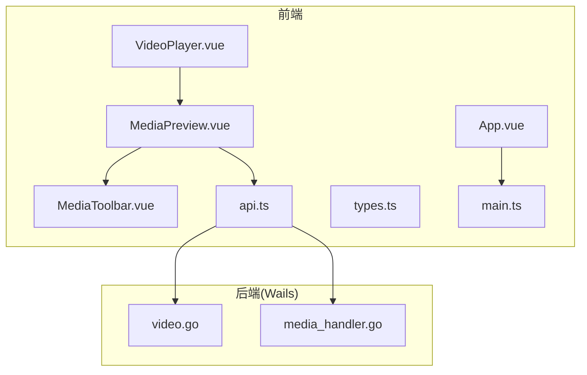
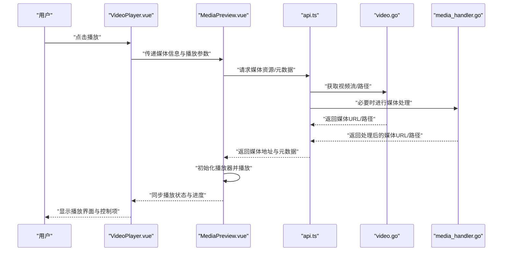
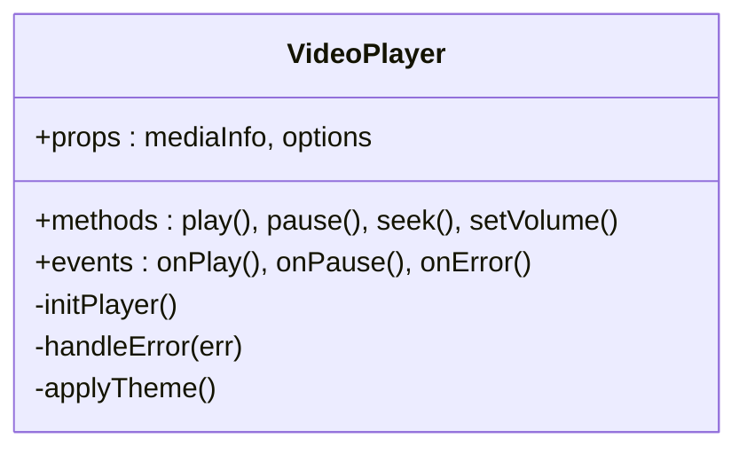
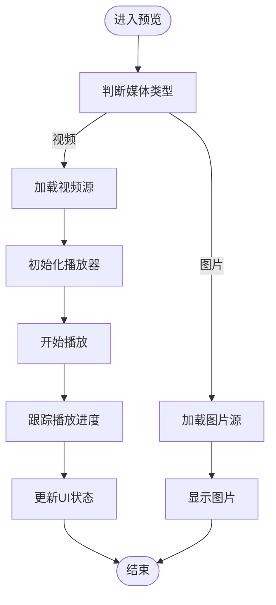
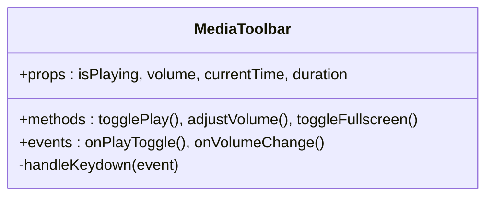
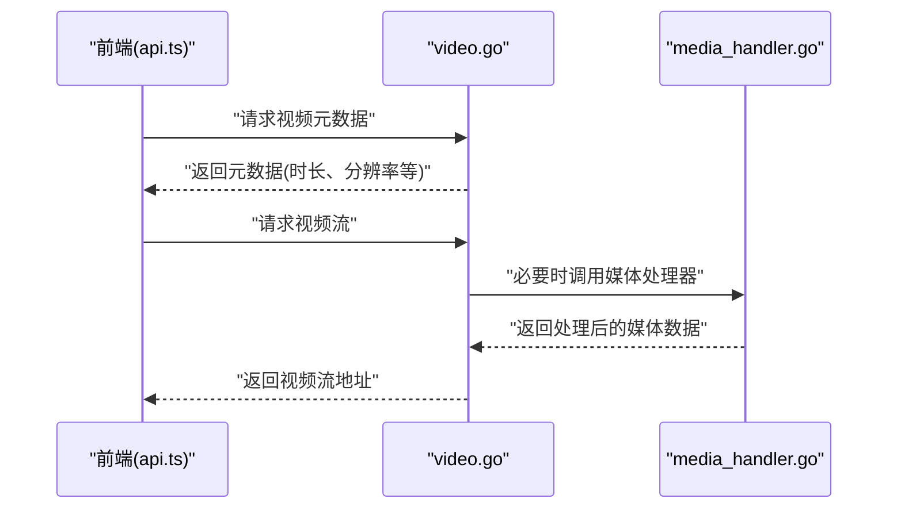
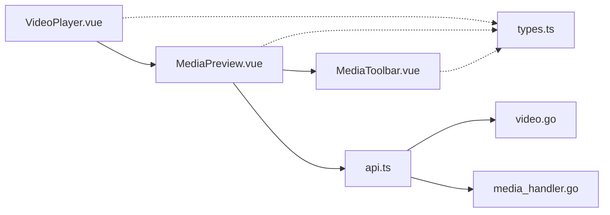

# 视频播放器组件

<cite>
**本文引用的文件**   
- [VideoPlayer.vue](file://src/frontend/src/components/VideoPlayer.vue)
- [MediaPreview.vue](file://src/frontend/src/components/MediaPreview.vue)
- [MediaToolbar.vue](file://src/frontend/src/components/MediaToolbar.vue)
- [api.ts](file://src/frontend/src/api.ts)
- [types.ts](file://src/frontend/src/types.ts)
- [video.go](file://src/internal/services/video.go)
- [media_handler.go](file://src/internal/services/media_handler.go)
- [App.vue](file://src/frontend/src/App.vue)
- [main.ts](file://src/frontend/src/main.ts)
</cite>

## 目录
1. [简介](#简介)
2. [项目结构](#项目结构)
3. [核心组件](#核心组件)
4. [架构总览](#架构总览)
5. [详细组件分析](#详细组件分析)
6. [依赖关系分析](#依赖关系分析)
7. [性能考虑](#性能考虑)
8. [故障排查指南](#故障排查指南)
9. [结论](#结论)
10. [附录](#附录)

## 简介
本文件围绕“视频播放器组件”进行系统化文档化，涵盖前端 Vue 组件、后端服务与数据流、主题适配与事件机制、以及常见问题定位方法。该组件用于在桌面应用中预览和播放媒体（含视频），通过 Wails 桥接 Go 后端能力，提供统一的媒体访问与播放体验。

## 项目结构
本项目采用前后端分离的桌面应用架构：
- 前端：Vue 3 + PrimeVue + Pinia + vue-router，组件遵循三段式结构（template → script setup → style scoped）。
- 后端：Go 服务通过 Wails 暴露 API，封装媒体处理、缩略图与视频流能力。
- 集成：前端统一通过 api.ts 调用 window.go.services.* 接口，类型契约由 types.ts 定义。

图表来源 
- [VideoPlayer.vue](file://src/frontend/src/components/VideoPlayer.vue)
- [MediaPreview.vue](file://src/frontend/src/components/MediaPreview.vue)
- [MediaToolbar.vue](file://src/frontend/src/components/MediaToolbar.vue)
- [api.ts](file://src/frontend/src/api.ts)
- [types.ts](file://src/frontend/src/types.ts)
- [video.go](file://src/internal/services/video.go)
- [media_handler.go](file://src/internal/services/media_handler.go)
- [App.vue](file://src/frontend/src/App.vue)
- [main.ts](file://src/frontend/src/main.ts)

章节来源
- [VideoPlayer.vue](file://src/frontend/src/components/VideoPlayer.vue)
- [MediaPreview.vue](file://src/frontend/src/components/MediaPreview.vue)
- [MediaToolbar.vue](file://src/frontend/src/components/MediaToolbar.vue)
- [api.ts](file://src/frontend/src/api.ts)
- [types.ts](file://src/frontend/src/types.ts)
- [video.go](file://src/internal/services/video.go)
- [media_handler.go](file://src/internal/services/media_handler.go)
- [App.vue](file://src/frontend/src/App.vue)
- [main.ts](file://src/frontend/src/main.ts)

## 核心组件
- VideoPlayer.vue：视频播放器容器，负责生命周期管理、播放控制、错误状态展示与主题适配。
- MediaPreview.vue：媒体预览通用组件，承载播放器与工具栏，处理媒体加载与进度更新。
- MediaToolbar.vue：媒体工具栏，提供播放/暂停、音量、全屏等交互。
- api.ts：统一的前端 API 封装，调用 window.go.services.* 暴露的后端能力。
- types.ts：前后端数据结构与类型契约，确保 JSON tag 一致。
- video.go：后端视频服务，提供视频流、元数据与播放相关接口。
- media_handler.go：后端媒体处理器，负责媒体文件读取、格式转换与缓存策略。

章节来源
- [VideoPlayer.vue](file://src/frontend/src/components/VideoPlayer.vue)
- [MediaPreview.vue](file://src/frontend/src/components/MediaPreview.vue)
- [MediaToolbar.vue](file://src/frontend/src/components/MediaToolbar.vue)
- [api.ts](file://src/frontend/src/api.ts)
- [types.ts](file://src/frontend/src/types.ts)
- [video.go](file://src/internal/services/video.go)
- [media_handler.go](file://src/internal/services/media_handler.go)

## 架构总览
视频播放的整体流程如下：
- 用户触发播放请求，VideoPlayer 将媒体信息传递给 MediaPreview。
- MediaPreview 通过 api.ts 调用后端 video.go 或 media_handler.go。
- 后端返回媒体流或本地路径，前端使用原生 <video> 或第三方播放器渲染。
- 播放状态、进度、错误通过事件或响应式状态同步到 UI。

图表来源 
- [VideoPlayer.vue](file://src/frontend/src/components/VideoPlayer.vue)
- [MediaPreview.vue](file://src/frontend/src/components/MediaPreview.vue)
- [api.ts](file://src/frontend/src/api.ts)
- [video.go](file://src/internal/services/video.go)
- [media_handler.go](file://src/internal/services/media_handler.go)

## 详细组件分析

### VideoPlayer.vue 组件分析
职责与实现要点：
- 生命周期管理：在 onMounted 中初始化播放器，在 onUnmounted 中释放资源。
- 播放控制：封装播放、暂停、跳转、音量调节等方法。
- 错误处理：捕获网络错误、解码失败、权限问题等，并提供用户提示。
- 主题适配：基于 CSS 变量与系统偏好检测，支持明暗主题切换。

图表来源 
- [VideoPlayer.vue](file://src/frontend/src/components/VideoPlayer.vue)

章节来源
- [VideoPlayer.vue](file://src/frontend/src/components/VideoPlayer.vue)

### MediaPreview.vue 组件分析
职责与实现要点：
- 媒体加载：根据媒体类型选择合适的数据源（本地路径、HTTP 流、Blob）。
- 进度跟踪：监听播放进度，更新 UI 与状态。
- 工具栏集成：与 MediaToolbar 协作，提供统一的控制入口。
- 错误边界：对加载失败、格式不支持等情况进行处理与降级。

图表来源 
- [MediaPreview.vue](file://src/frontend/src/components/MediaPreview.vue)

章节来源
- [MediaPreview.vue](file://src/frontend/src/components/MediaPreview.vue)

### MediaToolbar.vue 组件分析
职责与实现要点：
- 控制按钮：播放/暂停、音量滑块、全屏切换、倍速选择。
- 状态同步：与 MediaPreview 的状态双向绑定，确保 UI 一致性。
- 键盘快捷键：支持空格播放/暂停、方向键调整进度等。
- 无障碍支持：为关键控件添加 aria-label 与焦点管理。

图表来源 
- [MediaToolbar.vue](file://src/frontend/src/components/MediaToolbar.vue)

章节来源
- [MediaToolbar.vue](file://src/frontend/src/components/MediaToolbar.vue)

### 后端服务分析（video.go 与 media_handler.go）
职责与实现要点：
- video.go：提供视频元数据查询、视频流生成、播放地址解析等能力。
- media_handler.go：处理媒体文件的读取、格式转换、缓存策略与临时文件管理。
- 错误处理：统一错误码与消息，便于前端展示与调试。
- 性能优化：支持分块传输、并发下载、内存映射等技术。

图表来源 
- [video.go](file://src/internal/services/video.go)
- [media_handler.go](file://src/internal/services/media_handler.go)
- [api.ts](file://src/frontend/src/api.ts)

章节来源
- [video.go](file://src/internal/services/video.go)
- [media_handler.go](file://src/internal/services/media_handler.go)
- [api.ts](file://src/frontend/src/api.ts)

## 依赖关系分析
组件间依赖关系清晰，遵循单一职责原则：
- VideoPlayer 依赖 MediaPreview 进行实际渲染。
- MediaPreview 依赖 MediaToolbar 提供控制功能。
- 所有组件通过 api.ts 与后端服务通信。
- 类型定义集中在 types.ts，确保前后端契约一致。

图表来源 
- [VideoPlayer.vue](file://src/frontend/src/components/VideoPlayer.vue)
- [MediaPreview.vue](file://src/frontend/src/components/MediaPreview.vue)
- [MediaToolbar.vue](file://src/frontend/src/components/MediaToolbar.vue)
- [api.ts](file://src/frontend/src/api.ts)
- [types.ts](file://src/frontend/src/types.ts)
- [video.go](file://src/internal/services/video.go)
- [media_handler.go](file://src/internal/services/media_handler.go)

章节来源
- [VideoPlayer.vue](file://src/frontend/src/components/VideoPlayer.vue)
- [MediaPreview.vue](file://src/frontend/src/components/MediaPreview.vue)
- [MediaToolbar.vue](file://src/frontend/src/components/MediaToolbar.vue)
- [api.ts](file://src/frontend/src/api.ts)
- [types.ts](file://src/frontend/src/types.ts)
- [video.go](file://src/internal/services/video.go)
- [media_handler.go](file://src/internal/services/media_handler.go)

## 性能考虑
- 懒加载：仅在需要时加载媒体资源，避免初始页面过重。
- 缓存策略：合理使用浏览器缓存与后端临时文件缓存。
- 内存管理：及时释放播放器实例与媒体对象，防止内存泄漏。
- 网络优化：支持断点续传、分块下载与并发请求。
- 渲染优化：使用虚拟滚动与按需渲染，提升大数据量下的性能。

## 故障排查指南
常见问题与解决方案：
- 播放失败：检查媒体格式兼容性、网络权限与 CORS 设置。
- 黑屏或无声音：验证解码器支持、音频轨道存在性与音量设置。
- 卡顿或缓冲：检查网络带宽、服务器响应时间与缓存命中率。
- 主题异常：确认 CSS 变量定义与主题切换逻辑正确性。
- 日志查看：启用详细日志模式，收集错误堆栈与网络请求信息。

章节来源
- [VideoPlayer.vue](file://src/frontend/src/components/VideoPlayer.vue)
- [MediaPreview.vue](file://src/frontend/src/components/MediaPreview.vue)
- [MediaToolbar.vue](file://src/frontend/src/components/MediaToolbar.vue)
- [api.ts](file://src/frontend/src/api.ts)
- [video.go](file://src/internal/services/video.go)
- [media_handler.go](file://src/internal/services/media_handler.go)

## 结论
视频播放器组件通过前后端协作实现了完整的媒体播放功能。前端采用模块化设计，职责清晰；后端提供稳定的媒体处理能力。通过合理的性能优化与错误处理机制，确保了良好的用户体验。建议继续完善无障碍支持与国际化功能，进一步提升可访问性与全球适用性。

## 附录
- 开发规范：遵循 Vue 三段式结构与 CSS 变量主题适配。
- 构建命令：使用固定命令构建单一二进制文件。
- 依赖管理：使用 pnpm 管理前端依赖，Go 模块版本由子模块钉住。
- 事件机制：采用 channel + 事件驱动模式，确保线程安全与性能。