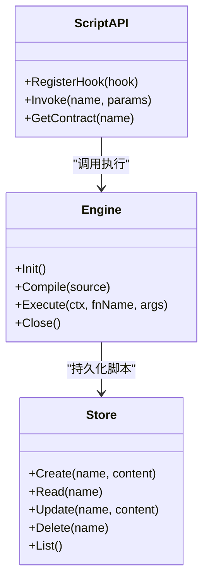
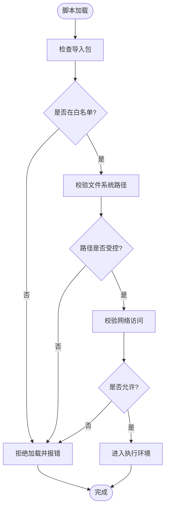
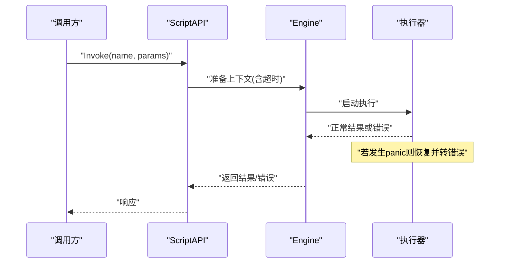
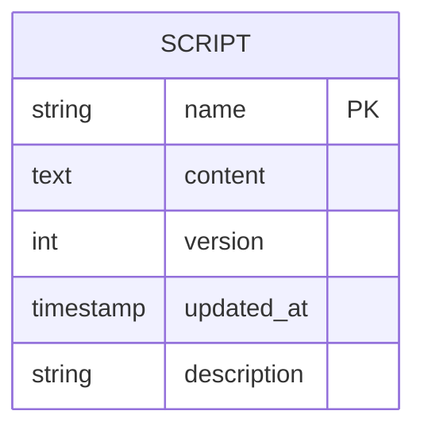
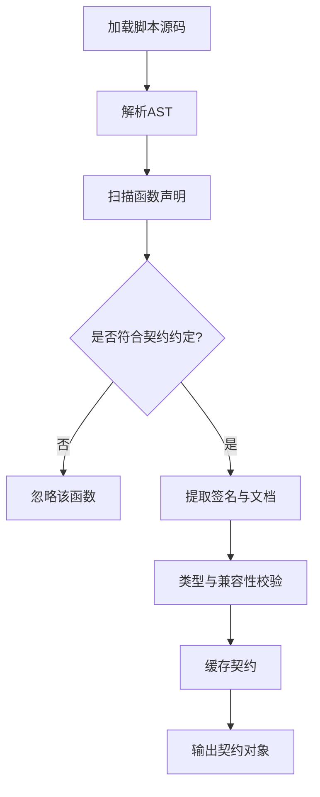
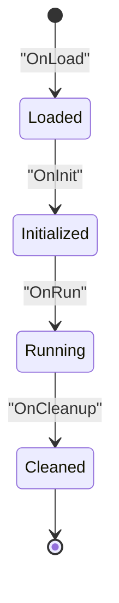

# 脚本引擎安全约束

<cite>
**本文引用的文件**   
- [src/internal/script/engine.go](file://src/internal/script/engine.go)
- [src/internal/script/store.go](file://src/internal/script/store.go)
- [src/internal/scriptapi/scriptapi.go](file://src/internal/scriptapi/scriptapi.go)
</cite>

## 目录
- 概述
- Yaegi 引擎封装
- 沙箱安全策略
- Panic 恢复与超时保护
- 脚本文件 CRUD
- 契约函数提取
- 生命周期钩子

## 概述
本章节聚焦于 src/internal/script/ 与 scriptapi/ 的脚本执行子系统，围绕以下目标进行说明：
- 基于 Yaegi 的 Go 脚本引擎封装与初始化流程
- 沙箱安全策略（禁用 os/exec、限制系统调用）
- Panic 恢复与 10 秒超时保护机制
- 脚本文件的创建、读取、更新、删除（CRUD）
- 契约函数提取机制（从脚本中识别可暴露的函数签名）
- 生命周期钩子（脚本加载、初始化、运行、销毁等阶段）

该子系统为上层服务提供安全的脚本执行能力，确保第三方或用户脚本在受限环境中运行，同时保持对宿主应用的可观测性与可控性。

## Yaegi 引擎封装
- 引擎初始化
  - 构建一个最小化的 Yaegi 解释器实例，注入必要的标准库白名单与宿主 API 绑定。
  - 预注册宿主提供的服务接口，供脚本通过固定命名空间访问。
- 脚本编译与执行
  - 将脚本源码解析为 AST，并进行类型检查；通过后缓存字节码以提升重复执行性能。
  - 执行入口由统一的调度器管理，支持并发隔离与资源清理。
- 上下文与依赖注入
  - 每次执行前注入请求级上下文（如超时、日志、追踪 ID），保证可观测性。
  - 注入只读配置与运行时状态快照，避免脚本修改宿主全局状态。

图示来源
- [src/internal/script/engine.go](file://src/internal/script/engine.go)
- [src/internal/script/store.go](file://src/internal/script/store.go)
- [src/internal/scriptapi/scriptapi.go](file://src/internal/scriptapi/scriptapi.go)

章节来源
- [src/internal/script/engine.go](file://src/internal/script/engine.go)
- [src/internal/script/store.go](file://src/internal/script/store.go)
- [src/internal/scriptapi/scriptapi.go](file://src/internal/scriptapi/scriptapi.go)

## 沙箱安全策略
- 标准库裁剪
  - 禁用危险包（如 os/exec、syscall、unsafe 等），仅保留必要的安全子集。
  - 通过白名单方式控制可用包与导出符号，防止越权调用。
- 文件系统与网络限制
  - 脚本仅能访问受控路径（如 /tmp 或应用数据目录），禁止任意路径读写。
  - 网络访问需经代理层校验，限制协议与目标域。
- 资源与权限控制
  - 限制 CPU、内存使用上限，防止资源耗尽攻击。
  - 禁止提升权限、访问敏感环境变量与系统信息。

章节来源
- [src/internal/script/engine.go](file://src/internal/script/engine.go)
- [src/internal/scriptapi/scriptapi.go](file://src/internal/scriptapi/scriptapi.go)

## Panic 恢复与超时保护
- Panic 恢复
  - 在执行入口包裹 recover 逻辑，捕获 panic 并转换为结构化错误返回。
  - 记录堆栈与上下文信息，便于定位问题。
- 超时保护
  - 默认 10 秒超时，可通过上下文取消或定时器强制中断。
  - 超时后释放资源、清理 goroutine，避免泄漏。
- 重试与熔断
  - 对幂等操作支持有限重试；对频繁失败场景触发熔断，降低影响面。

图示来源
- [src/internal/script/engine.go](file://src/internal/script/engine.go)
- [src/internal/scriptapi/scriptapi.go](file://src/internal/scriptapi/scriptapi.go)

章节来源
- [src/internal/script/engine.go](file://src/internal/script/engine.go)
- [src/internal/scriptapi/scriptapi.go](file://src/internal/scriptapi/scriptapi.go)

## 脚本文件 CRUD
- 存储模型
  - 脚本以“名称-内容”形式持久化，支持元数据（版本、更新时间、描述）。
  - 提供列表查询、按名称检索、批量操作等能力。
- 操作语义
  - Create：校验名称唯一性与内容合法性，写入存储。
  - Read：按名称获取脚本内容与元数据。
  - Update：原子更新，版本号递增，支持回滚。
  - Delete：软删除标记，保留审计轨迹。
- 事务与一致性
  - 写操作采用事务或锁机制，保证并发安全。
  - 读多写少场景引入缓存层，提高吞吐。

章节来源
- [src/internal/script/store.go](file://src/internal/script/store.go)

## 契约函数提取
- 目的
  - 从脚本源码中提取可被宿主调用的函数签名，形成“契约”，用于 UI 展示、参数校验与调用路由。
- 提取规则
  - 约定函数命名规范（如 Hook_前缀或特定注解）。
  - 解析 AST，收集函数名、参数类型、返回值类型与注释文档。
  - 生成结构化的契约对象，供上层服务消费。
- 校验与缓存
  - 首次提取后进行类型校验与兼容性检查。
  - 对未变更的脚本缓存契约，减少解析开销。

章节来源
- [src/internal/script/engine.go](file://src/internal/script/engine.go)
- [src/internal/scriptapi/scriptapi.go](file://src/internal/scriptapi/scriptapi.go)

## 生命周期钩子
- 钩子类型
  - OnLoad：脚本加载完成后触发，用于初始化资源。
  - OnInit：执行前初始化，注入上下文与依赖。
  - OnRun：实际业务逻辑执行点。
  - OnCleanup：执行结束后清理资源。
- 实现要点
  - 钩子函数由宿主统一注册与调度，脚本侧按需实现。
  - 钩子执行同样受沙箱与超时保护约束。
  - 错误处理与日志记录贯穿各阶段，确保可观测性。

章节来源
- [src/internal/script/engine.go](file://src/internal/script/engine.go)
- [src/internal/scriptapi/scriptapi.go](file://src/internal/scriptapi/scriptapi.go)