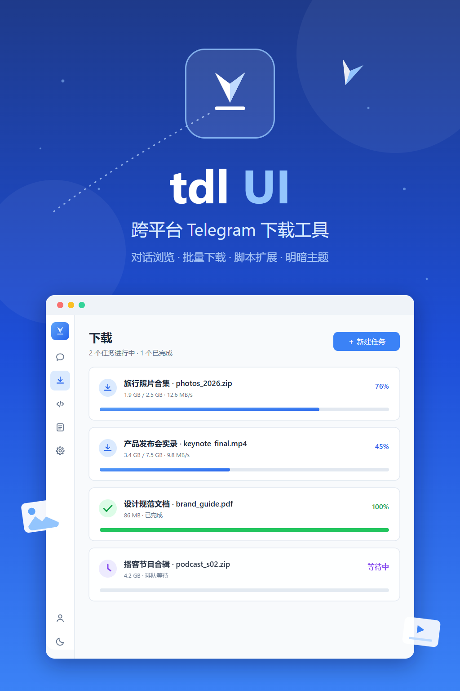

# tdl UI

> 基于 [tdl](https://github.com/GitHubNull/tdl) 的 Telegram 媒体下载桌面客户端

[English](README_EN.md) | 简体中文

tdl UI 是对命令行工具 tdl 的 GUI 化改造：复用其经过验证的下载引擎与会话体系，用 [Wails v2](https://wails.io) + [Vue 3](https://vuejs.org) + [PrimeVue 4](https://primevue.org) 打造简约美观的桌面界面，并内置 [Yaegi](https://github.com/traefik/yaegi) Go 脚本引擎实现灵活的下载过滤、重命名与任务自动化。

## 功能特性

- **账号登录**：验证码登录、二维码扫码登录、Telegram Desktop 会话一键导入
- **对话浏览**：双面板浏览对话列表与媒体文件，支持搜索/过滤/分页，缩略图预览
- **媒体下载**：从对话勾选选集下载，或粘贴消息链接批量下载，多线程 + 断点续传（与 tdl CLI 同源引擎）
- **任务管理**：实时进度、速度展示，支持暂停 / 恢复（断点续传）/ 取消
- **脚本引擎**（Yaegi，Go 语法）：
  - `Filter` / `Rename` —— 按条件跳过文件、自定义文件名
  - `OnTaskStart` / `OnFileDone` / `OnTaskDone` —— 任务生命周期钩子
- **代理支持**：SOCKS5 / HTTP 代理
- **简约界面**：亮 / 暗 / 跟随系统三主题，localStorage 持久化，单一二进制免安装

## 界面预览

> （截图占位：登录页 / 对话页 / 下载页 / 脚本页 / 设置页）

<p align="center">
  
</p>

## 安装

从 Releases 下载 `tdl-ui.exe`（Windows x64），双击运行即可，无需安装。

### 从源码构建

环境要求：Go 1.25+、Node.js 20+、pnpm、[Wails CLI v2](https://wails.io/docs/gettingstarted/installation)。

```bash
git clone --recurse-submodules <本仓库地址>
cd tdl_UI/src
wails build -ldflags "-s -w" -trimpath
# 产物：src/build/bin/tdl-ui.exe
```

> 体积说明：因内置 gotd（Telegram MTProto）与 Yaegi 解释器，二进制约 50 MB。
> 如需减小体积，可用 [UPX](https://upx.github.io/) 压缩：`upx --best tdl-ui.exe`（约可减半，启动时间略有增加）。

## 快速开始

1. 打开应用，在 **账号** 页登录 Telegram（推荐二维码扫码）
2. 在 **对话** 页左侧选择对话，右侧浏览媒体文件（支持按类型/关键词/大小过滤）
3. 勾选要下载的文件，点击「下载选中」；或前往 **下载** 页粘贴消息链接创建任务
4. 在 **下载** 页查看实时进度，可暂停 / 恢复（断点续传）/ 取消
5. （可选）在 **脚本** 页编写 Go 脚本实现过滤、重命名与自动化钩子

## 文档索引

| 系列 | 说明 |
| --- | --- |
| [使用教程](doc/tutorials/README.md) | 按难度分级：安装登录 → 下载与设置 → 脚本进阶 |
| [开发者文档](doc/dev-human/README.md) | 面向人类开发者：环境搭建、架构原理、扩展指南 |
| [AI 代理文档](doc/dev-ai/README.md) | 面向 AI 编程代理：项目约束、修改配方、升级剧本 |

## 项目结构

```
├── ref/tdl      # tdl 上游子模块（只读，仅允许同步上游）
├── src/         # Wails 应用源码（Go 后端 + Vue 前端）
├── doc/         # 文档体系（tutorials / dev-human / dev-ai）
├── tmp/         # 临时文件（不入库）
└── agent.md     # AI 编程代理速览指南
```

## 许可证与声明

本项目复用了 [tdl](https://github.com/GitHubNull/tdl) 的代码（Git 子模块 + `go.mod replace` 引用），依其协议以 [AGPL-3.0](LICENSE) 发布。

使用前请阅读[免责声明](DISCLAIMER.md)：本工具仅限合法用途，请遵守 Telegram 服务条款与当地法律法规。
